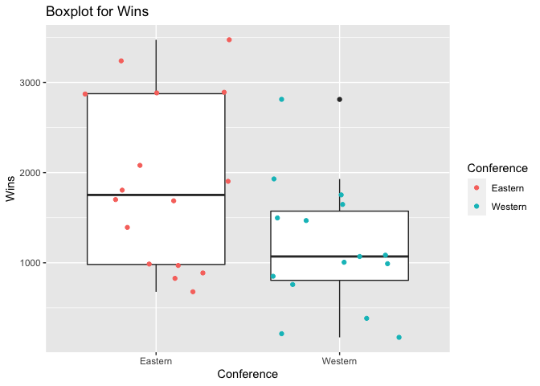

Project 1
================
Zichang Xiang
6/16/2021

-   [Reading and summarizing data from NHL
    API](#reading-and-summarizing-data-from-nhl-api)
-   [Functions to contact the NHL records
    API](#functions-to-contact-the-nhl-records-api)
-   [Function to contact the NHL stats
    API](#function-to-contact-the-nhl-stats-api)
-   [Wrapper function to call other
    functions](#wrapper-function-to-call-other-functions)
-   [Basic exploratory data analysis](#basic-exploratory-data-analysis)

### Reading and summarizing data from NHL API

#### Required Packages

rmarkdown, jsonlite, ggplot2, dplyr, knitr, RCurl, httr

``` r
#load the required packages
library(rmarkdown)
library(jsonlite)
library(ggplot2)
library(dplyr)
library(knitr)
library(RCurl)
library(httr)
```

### Functions to contact the NHL records API

#### Function to return franchise

``` r
#retrieve the info and convert to a list
get_franchise  <- GET("https://records.nhl.com/site/api/franchise")
franchise_cont <- content(get_franchise, "text", encoding = "UTF-8")
franchise_json <- fromJSON(franchise_cont, flatten = TRUE)
franchise_list <- as_tibble(franchise_json$data)
franchise_list
```

    ## # A tibble: 39 x 8
    ##       id firstSeasonId fullName         lastSeasonId mostRecentTeamId teamAbbrev
    ##    <int>         <int> <chr>                   <int>            <int> <chr>     
    ##  1     1      19171918 Montréal Canadi…           NA                8 MTL       
    ##  2     2      19171918 Montreal Wander…     19171918               41 MWN       
    ##  3     3      19171918 St. Louis Eagles     19341935               45 SLE       
    ##  4     4      19191920 Hamilton Tigers      19241925               37 HAM       
    ##  5     5      19171918 Toronto Maple L…           NA               10 TOR       
    ##  6     6      19241925 Boston Bruins              NA                6 BOS       
    ##  7     7      19241925 Montreal Maroons     19371938               43 MMR       
    ##  8     8      19251926 Brooklyn Americ…     19411942               51 BRK       
    ##  9     9      19251926 Philadelphia Qu…     19301931               39 QUA       
    ## 10    10      19261927 New York Rangers           NA                3 NYR       
    ## # … with 29 more rows, and 2 more variables: teamCommonName <chr>,
    ## #   teamPlaceName <chr>

``` r
#create function franchise
franchise <- function(name) {
  if (is.character(name)){
  return(franchise_list %>% 
           filter (fullName == name | teamAbbrev == name | teamCommonName == name |
                    teamPlaceName == name))
  }else if (is.numeric(name)){
  return(franchise_list %>% filter(mostRecentTeamId == name))
  }else{
    stop("Wrong input!")
  }
}

#try to use function franchise
franchise(8)
```

    ## # A tibble: 1 x 8
    ##      id firstSeasonId fullName          lastSeasonId mostRecentTeamId teamAbbrev
    ##   <int>         <int> <chr>                    <int>            <int> <chr>     
    ## 1     1      19171918 Montréal Canadie…           NA                8 MTL       
    ## # … with 2 more variables: teamCommonName <chr>, teamPlaceName <chr>

#### Function to return total stats for every franchise

``` r
#retrieve info and convert to a list
get_total  <- GET("https://records.nhl.com/site/api/franchise-team-totals")
total_cont <- content(get_total, "text", encoding = "UTF-8")
total_json <- fromJSON(total_cont, flatten = TRUE)
total_list <- as_tibble(total_json$data)
total_list
```

    ## # A tibble: 105 x 30
    ##       id activeFranchise firstSeasonId franchiseId gameTypeId gamesPlayed
    ##    <int>           <int>         <int>       <int>      <int>       <int>
    ##  1     1               1      19821983          23          2        2993
    ##  2     2               1      19821983          23          3         257
    ##  3     3               1      19721973          22          2        3788
    ##  4     4               1      19721973          22          3         310
    ##  5     5               1      19261927          10          2        6560
    ##  6     6               1      19261927          10          3         518
    ##  7     7               1      19671968          16          3         449
    ##  8     8               1      19671968          16          2        4171
    ##  9     9               1      19671968          17          2        4171
    ## 10    10               1      19671968          17          3         391
    ## # … with 95 more rows, and 24 more variables: goalsAgainst <int>,
    ## #   goalsFor <int>, homeLosses <int>, homeOvertimeLosses <int>, homeTies <int>,
    ## #   homeWins <int>, lastSeasonId <int>, losses <int>, overtimeLosses <int>,
    ## #   penaltyMinutes <int>, pointPctg <dbl>, points <int>, roadLosses <int>,
    ## #   roadOvertimeLosses <int>, roadTies <int>, roadWins <int>,
    ## #   shootoutLosses <int>, shootoutWins <int>, shutouts <int>, teamId <int>,
    ## #   teamName <chr>, ties <int>, triCode <chr>, wins <int>

``` r
#create function team_totals
team_totals <- function(name) {
  if (is.character(name)){
  return(total_list %>% filter(teamName == name | triCode == name))
  }else if (is.numeric(name)){
  return(total_list %>% filter(franchiseId == name) )
  }else{
    stop("Wrong input!")
  }
}

#try to use function team_totals
team_totals("MTL")
```

    ## # A tibble: 2 x 30
    ##      id activeFranchise firstSeasonId franchiseId gameTypeId gamesPlayed
    ##   <int>           <int>         <int>       <int>      <int>       <int>
    ## 1    15               1      19171918           1          3         773
    ## 2    16               1      19171918           1          2        6787
    ## # … with 24 more variables: goalsAgainst <int>, goalsFor <int>,
    ## #   homeLosses <int>, homeOvertimeLosses <int>, homeTies <int>, homeWins <int>,
    ## #   lastSeasonId <int>, losses <int>, overtimeLosses <int>,
    ## #   penaltyMinutes <int>, pointPctg <dbl>, points <int>, roadLosses <int>,
    ## #   roadOvertimeLosses <int>, roadTies <int>, roadWins <int>,
    ## #   shootoutLosses <int>, shootoutWins <int>, shutouts <int>, teamId <int>,
    ## #   teamName <chr>, ties <int>, triCode <chr>, wins <int>

#### Function to return season records

``` r
#create data frame lookup including name and id
base_url    <- paste0("https://records.nhl.com/site/api/franchise-season-records")
get_season  <- GET(base_url)
season_cont <- content(get_season, "text", encoding = "UTF-8")
season_json <- fromJSON(season_cont, flatten = TRUE)
season_list <- as_tibble(season_json$data)
lookup <- season_list[,c(14,15)]
lookup
```

    ## # A tibble: 39 x 2
    ##    franchiseId franchiseName      
    ##          <int> <chr>              
    ##  1          23 New Jersey Devils  
    ##  2          22 New York Islanders 
    ##  3          10 New York Rangers   
    ##  4          16 Philadelphia Flyers
    ##  5          17 Pittsburgh Penguins
    ##  6           6 Boston Bruins      
    ##  7          19 Buffalo Sabres     
    ##  8           1 Montréal Canadiens 
    ##  9          30 Ottawa Senators    
    ## 10           5 Toronto Maple Leafs
    ## # … with 29 more rows

``` r
#create function season
season <- function(name) {
  if (name %in% lookup$franchiseId){
    full_url <- paste0("https://records.nhl.com/site/api/franchise-season-records?cayenneExp=franchiseId=", name)
  }else if (name %in% lookup$franchiseName){
    id <- lookup %>% filter(franchiseName == name) %>% select(1)
    full_url <- paste0("https://records.nhl.com/site/api/franchise-season-records?cayenneExp=franchiseId=", id)
  }else{
    stop("Wrong input!")
  }
    get_season  <- GET(full_url)
    season_cont <- content(get_season, "text", encoding = "UTF-8")
    season_json <- fromJSON(season_cont, flatten = TRUE)
    season_list <- as_tibble(season_json$data)
  return(season_list)
}

#try to use function goalie
season(1)
```

    ## # A tibble: 1 x 57
    ##      id fewestGoals fewestGoalsAgainst fewestGoalsAgainstSeas… fewestGoalsSeaso…
    ##   <int>       <int>              <int> <chr>                   <chr>            
    ## 1     8         155                131 1955-56 (70)            1952-53 (70)     
    ## # … with 52 more variables: fewestLosses <int>, fewestLossesSeasons <chr>,
    ## #   fewestPoints <int>, fewestPointsSeasons <chr>, fewestTies <int>,
    ## #   fewestTiesSeasons <chr>, fewestWins <int>, fewestWinsSeasons <chr>,
    ## #   franchiseId <int>, franchiseName <chr>, homeLossStreak <int>,
    ## #   homeLossStreakDates <chr>, homePointStreak <int>,
    ## #   homePointStreakDates <chr>, homeWinStreak <int>, homeWinStreakDates <chr>,
    ## #   homeWinlessStreak <int>, homeWinlessStreakDates <chr>, lossStreak <int>,
    ## #   lossStreakDates <chr>, mostGameGoals <int>, mostGameGoalsDates <chr>,
    ## #   mostGoals <int>, mostGoalsAgainst <int>, mostGoalsAgainstSeasons <chr>,
    ## #   mostGoalsSeasons <chr>, mostLosses <int>, mostLossesSeasons <chr>,
    ## #   mostPenaltyMinutes <int>, mostPenaltyMinutesSeasons <chr>,
    ## #   mostPoints <int>, mostPointsSeasons <chr>, mostShutouts <int>,
    ## #   mostShutoutsSeasons <chr>, mostTies <int>, mostTiesSeasons <chr>,
    ## #   mostWins <int>, mostWinsSeasons <chr>, pointStreak <int>,
    ## #   pointStreakDates <chr>, roadLossStreak <int>, roadLossStreakDates <chr>,
    ## #   roadPointStreak <int>, roadPointStreakDates <chr>, roadWinStreak <int>,
    ## #   roadWinStreakDates <chr>, roadWinlessStreak <int>,
    ## #   roadWinlessStreakDates <chr>, winStreak <int>, winStreakDates <chr>,
    ## #   winlessStreak <int>, winlessStreakDates <chr>

``` r
season("Montréal Canadiens")
```

    ## # A tibble: 1 x 57
    ##      id fewestGoals fewestGoalsAgainst fewestGoalsAgainstSeas… fewestGoalsSeaso…
    ##   <int>       <int>              <int> <chr>                   <chr>            
    ## 1     8         155                131 1955-56 (70)            1952-53 (70)     
    ## # … with 52 more variables: fewestLosses <int>, fewestLossesSeasons <chr>,
    ## #   fewestPoints <int>, fewestPointsSeasons <chr>, fewestTies <int>,
    ## #   fewestTiesSeasons <chr>, fewestWins <int>, fewestWinsSeasons <chr>,
    ## #   franchiseId <int>, franchiseName <chr>, homeLossStreak <int>,
    ## #   homeLossStreakDates <chr>, homePointStreak <int>,
    ## #   homePointStreakDates <chr>, homeWinStreak <int>, homeWinStreakDates <chr>,
    ## #   homeWinlessStreak <int>, homeWinlessStreakDates <chr>, lossStreak <int>,
    ## #   lossStreakDates <chr>, mostGameGoals <int>, mostGameGoalsDates <chr>,
    ## #   mostGoals <int>, mostGoalsAgainst <int>, mostGoalsAgainstSeasons <chr>,
    ## #   mostGoalsSeasons <chr>, mostLosses <int>, mostLossesSeasons <chr>,
    ## #   mostPenaltyMinutes <int>, mostPenaltyMinutesSeasons <chr>,
    ## #   mostPoints <int>, mostPointsSeasons <chr>, mostShutouts <int>,
    ## #   mostShutoutsSeasons <chr>, mostTies <int>, mostTiesSeasons <chr>,
    ## #   mostWins <int>, mostWinsSeasons <chr>, pointStreak <int>,
    ## #   pointStreakDates <chr>, roadLossStreak <int>, roadLossStreakDates <chr>,
    ## #   roadPointStreak <int>, roadPointStreakDates <chr>, roadWinStreak <int>,
    ## #   roadWinStreakDates <chr>, roadWinlessStreak <int>,
    ## #   roadWinlessStreakDates <chr>, winStreak <int>, winStreakDates <chr>,
    ## #   winlessStreak <int>, winlessStreakDates <chr>

#### Function to return goalie records

``` r
#create data frame lookup
base_url <- paste0("https://records.nhl.com/site/api/franchise-goalie-records")
get_goalie  <- GET(base_url)
goalie_cont <- content(get_goalie, "text", encoding = "UTF-8")
goalie_json <- fromJSON(goalie_cont, flatten = TRUE)
goalie_list <- as_tibble(goalie_json$data)
lookup <- goalie_list[ , c(4, 5)]
lookup
```

    ## # A tibble: 1,078 x 2
    ##    franchiseId franchiseName      
    ##          <int> <chr>              
    ##  1          15 Dallas Stars       
    ##  2          28 Arizona Coyotes    
    ##  3          11 Chicago Blackhawks 
    ##  4          25 Edmonton Oilers    
    ##  5          16 Philadelphia Flyers
    ##  6          18 St. Louis Blues    
    ##  7          24 Washington Capitals
    ##  8          18 St. Louis Blues    
    ##  9          20 Vancouver Canucks  
    ## 10          13 Cleveland Barons   
    ## # … with 1,068 more rows

``` r
#create function goalie
goalie <- function(name) {
  if (name %in% lookup$franchiseId){
    full_url <- paste0("https://records.nhl.com/site/api/franchise-goalie-records?cayenneExp=franchiseId=", name)
  }else if (name %in% lookup$franchiseName){
    id <- lookup %>% filter(franchiseName == name) %>% select(1) %>% unique()
    full_url <- paste0("https://records.nhl.com/site/api/franchise-goalie-records?cayenneExp=franchiseId=", id)
  }else{
    stop("Wrong input!")
  }
    get_goalie  <- GET(full_url)
    goalie_cont <- content(get_goalie, "text", encoding = "UTF-8")
    goalie_json <- fromJSON(goalie_cont, flatten = TRUE)
    goalie_list <- as_tibble(goalie_json$data)
  return(goalie_list)
}

#try to use function goalie
goalie(15)
```

    ## # A tibble: 37 x 29
    ##       id activePlayer firstName franchiseId franchiseName gameTypeId gamesPlayed
    ##    <int> <lgl>        <chr>           <int> <chr>              <int>       <int>
    ##  1   235 FALSE        Don                15 Dallas Stars           2         315
    ##  2   344 FALSE        Ed                 15 Dallas Stars           2         307
    ##  3   351 FALSE        Allan              15 Dallas Stars           2          10
    ##  4   354 FALSE        Daniel             15 Dallas Stars           2           5
    ##  5   399 FALSE        Gary               15 Dallas Stars           2          51
    ##  6   451 FALSE        Brian              15 Dallas Stars           2          26
    ##  7   488 FALSE        Jean               15 Dallas Stars           2           1
    ##  8   503 FALSE        Markus             15 Dallas Stars           2           2
    ##  9   513 FALSE        Roland             15 Dallas Stars           2          26
    ## 10   515 FALSE        Gilles             15 Dallas Stars           2         327
    ## # … with 27 more rows, and 22 more variables: lastName <chr>, losses <int>,
    ## #   mostGoalsAgainstDates <chr>, mostGoalsAgainstOneGame <int>,
    ## #   mostSavesDates <chr>, mostSavesOneGame <int>, mostShotsAgainstDates <chr>,
    ## #   mostShotsAgainstOneGame <int>, mostShutoutsOneSeason <int>,
    ## #   mostShutoutsSeasonIds <chr>, mostWinsOneSeason <int>,
    ## #   mostWinsSeasonIds <chr>, overtimeLosses <int>, playerId <int>,
    ## #   positionCode <chr>, rookieGamesPlayed <int>, rookieShutouts <int>,
    ## #   rookieWins <int>, seasons <int>, shutouts <int>, ties <int>, wins <int>

``` r
goalie("Dallas Stars")
```

    ## # A tibble: 37 x 29
    ##       id activePlayer firstName franchiseId franchiseName gameTypeId gamesPlayed
    ##    <int> <lgl>        <chr>           <int> <chr>              <int>       <int>
    ##  1   235 FALSE        Don                15 Dallas Stars           2         315
    ##  2   344 FALSE        Ed                 15 Dallas Stars           2         307
    ##  3   351 FALSE        Allan              15 Dallas Stars           2          10
    ##  4   354 FALSE        Daniel             15 Dallas Stars           2           5
    ##  5   399 FALSE        Gary               15 Dallas Stars           2          51
    ##  6   451 FALSE        Brian              15 Dallas Stars           2          26
    ##  7   488 FALSE        Jean               15 Dallas Stars           2           1
    ##  8   503 FALSE        Markus             15 Dallas Stars           2           2
    ##  9   513 FALSE        Roland             15 Dallas Stars           2          26
    ## 10   515 FALSE        Gilles             15 Dallas Stars           2         327
    ## # … with 27 more rows, and 22 more variables: lastName <chr>, losses <int>,
    ## #   mostGoalsAgainstDates <chr>, mostGoalsAgainstOneGame <int>,
    ## #   mostSavesDates <chr>, mostSavesOneGame <int>, mostShotsAgainstDates <chr>,
    ## #   mostShotsAgainstOneGame <int>, mostShutoutsOneSeason <int>,
    ## #   mostShutoutsSeasonIds <chr>, mostWinsOneSeason <int>,
    ## #   mostWinsSeasonIds <chr>, overtimeLosses <int>, playerId <int>,
    ## #   positionCode <chr>, rookieGamesPlayed <int>, rookieShutouts <int>,
    ## #   rookieWins <int>, seasons <int>, shutouts <int>, ties <int>, wins <int>

#### Function to return skater records

``` r
#create data frame lookup
base_url <- paste0("https://records.nhl.com/site/api/franchise-skater-records")
get_skater  <- GET(base_url)
skater_cont <- content(get_skater, "text", encoding = "UTF-8")
skater_json <- fromJSON(skater_cont, flatten = TRUE)
skater_list <- as_tibble(skater_json$data)
lookup <- skater_list[ , c(5, 6)]
lookup
```

    ## # A tibble: 17,209 x 2
    ##    franchiseId franchiseName       
    ##          <int> <chr>               
    ##  1           5 Toronto Maple Leafs 
    ##  2           2 Montreal Wanderers  
    ##  3           6 Boston Bruins       
    ##  4           1 Montréal Canadiens  
    ##  5           6 Boston Bruins       
    ##  6           9 Philadelphia Quakers
    ##  7           9 Philadelphia Quakers
    ##  8          16 Philadelphia Flyers 
    ##  9          23 New Jersey Devils   
    ## 10           2 Montreal Wanderers  
    ## # … with 17,199 more rows

``` r
#create function skater
skater <- function(name) {
  if (name %in% lookup$franchiseId){
    full_url <- paste0("https://records.nhl.com/site/api/franchise-skater-records?cayenneExp=franchiseId=", name)
  }else if (name %in% lookup$franchiseName){
    id <- lookup %>% filter(franchiseName == name) %>% select(1) %>% unique()
    full_url <- paste0("https://records.nhl.com/site/api/franchise-skater-records?cayenneExp=franchiseId=", id)
  }else{
    stop("Wrong input!")
  }
    get_skater  <- GET(full_url)
    skater_cont <- content(get_skater, "text", encoding = "UTF-8")
    skater_json <- fromJSON(skater_cont, flatten = TRUE)
    skater_list <- as_tibble(skater_json$data)
  return(skater_list)
}

#try to use function skater
skater(1)
```

    ## # A tibble: 800 x 31
    ##       id activePlayer assists firstName franchiseId franchiseName     gameTypeId
    ##    <int> <lgl>          <int> <chr>           <int> <chr>                  <int>
    ##  1 17199 FALSE              0 Reg                 1 Montréal Canadie…          2
    ##  2 17223 FALSE              2 Art                 1 Montréal Canadie…          2
    ##  3 17272 FALSE              0 Dave                1 Montréal Canadie…          2
    ##  4 17351 FALSE              0 Ossie               1 Montréal Canadie…          2
    ##  5 17389 FALSE              0 Ron                 1 Montréal Canadie…          2
    ##  6 17440 FALSE              0 Jimmy               1 Montréal Canadie…          2
    ##  7 17484 FALSE              0 Max                 1 Montréal Canadie…          2
    ##  8 17508 FALSE              0 Bob                 1 Montréal Canadie…          2
    ##  9 17544 FALSE              0 Garry               1 Montréal Canadie…          2
    ## 10 17623 FALSE              0 Conrad              1 Montréal Canadie…          2
    ## # … with 790 more rows, and 24 more variables: gamesPlayed <int>, goals <int>,
    ## #   lastName <chr>, mostAssistsGameDates <chr>, mostAssistsOneGame <int>,
    ## #   mostAssistsOneSeason <int>, mostAssistsSeasonIds <chr>,
    ## #   mostGoalsGameDates <chr>, mostGoalsOneGame <int>, mostGoalsOneSeason <int>,
    ## #   mostGoalsSeasonIds <chr>, mostPenaltyMinutesOneSeason <int>,
    ## #   mostPenaltyMinutesSeasonIds <chr>, mostPointsGameDates <chr>,
    ## #   mostPointsOneGame <int>, mostPointsOneSeason <int>,
    ## #   mostPointsSeasonIds <chr>, penaltyMinutes <int>, playerId <int>,
    ## #   points <int>, positionCode <chr>, rookieGamesPlayed <int>,
    ## #   rookiePoints <int>, seasons <int>

``` r
skater("Washington Capitals")
```

    ## # A tibble: 521 x 31
    ##       id activePlayer assists firstName franchiseId franchiseName     gameTypeId
    ##    <int> <lgl>          <int> <chr>           <int> <chr>                  <int>
    ##  1 17250 FALSE              0 Keith              24 Washington Capit…          2
    ##  2 17280 FALSE              1 Murray             24 Washington Capit…          2
    ##  3 17541 FALSE              2 Chuck              24 Washington Capit…          2
    ##  4 17705 FALSE              0 Bob                24 Washington Capit…          2
    ##  5 17941 FALSE              0 Yves               24 Washington Capit…          2
    ##  6 17991 FALSE              1 Benoit             24 Washington Capit…          2
    ##  7 18313 FALSE              6 Jeff               24 Washington Capit…          2
    ##  8 18520 FALSE              0 Eric               24 Washington Capit…          2
    ##  9 18544 FALSE              0 Tony               24 Washington Capit…          2
    ## 10 18733 FALSE              2 Tom                24 Washington Capit…          2
    ## # … with 511 more rows, and 24 more variables: gamesPlayed <int>, goals <int>,
    ## #   lastName <chr>, mostAssistsGameDates <chr>, mostAssistsOneGame <int>,
    ## #   mostAssistsOneSeason <int>, mostAssistsSeasonIds <chr>,
    ## #   mostGoalsGameDates <chr>, mostGoalsOneGame <int>, mostGoalsOneSeason <int>,
    ## #   mostGoalsSeasonIds <chr>, mostPenaltyMinutesOneSeason <int>,
    ## #   mostPenaltyMinutesSeasonIds <chr>, mostPointsGameDates <chr>,
    ## #   mostPointsOneGame <int>, mostPointsOneSeason <int>,
    ## #   mostPointsSeasonIds <chr>, penaltyMinutes <int>, playerId <int>,
    ## #   points <int>, positionCode <chr>, rookieGamesPlayed <int>,
    ## #   rookiePoints <int>, seasons <int>

#### Function to return detail records

``` r
#create data frame lookup
base_url <- paste0("https://records.nhl.com/site/api/franchise-detail?")
get_detail  <- GET(base_url)
detail_cont <- content(get_detail, "text", encoding = "UTF-8")
detail_json <- fromJSON(detail_cont, flatten = TRUE)
detail_list <- as_tibble(detail_json$data)
detail_list
```

    ## # A tibble: 39 x 13
    ##       id active captainHistory     coachingHistory     dateAwarded directoryUrl 
    ##    <int> <lgl>  <chr>              <chr>               <chr>       <chr>        
    ##  1     1 TRUE   "<ul class=\"stri… "<ul class=\"strip… 1917-11-26… https://www.…
    ##  2     2 FALSE   <NA>               <NA>               1917-11-26… <NA>         
    ##  3     3 FALSE   <NA>               <NA>               1917-11-26… <NA>         
    ##  4     4 FALSE   <NA>               <NA>               1917-11-26… <NA>         
    ##  5     5 TRUE   "<ul class=\"stri… "<ul class=\"strip… 1917-11-26… https://www.…
    ##  6     6 TRUE   "<ul class=\"stri… "<ul class=\"strip… 1924-11-01… https://www.…
    ##  7     7 FALSE   <NA>               <NA>               1924-11-01… <NA>         
    ##  8     8 FALSE   <NA>               <NA>               1925-09-22… <NA>         
    ##  9     9 FALSE   <NA>               <NA>               1925-11-07… <NA>         
    ## 10    10 TRUE   "<ul class=\"stri… "<ul class=\"strip… 1926-05-15… https://www.…
    ## # … with 29 more rows, and 7 more variables: firstSeasonId <int>,
    ## #   generalManagerHistory <chr>, heroImageUrl <chr>, mostRecentTeamId <int>,
    ## #   retiredNumbersSummary <chr>, teamAbbrev <chr>, teamFullName <chr>

``` r
lookup <- detail_list[, c(10,13)]
lookup
```

    ## # A tibble: 39 x 2
    ##    mostRecentTeamId teamFullName        
    ##               <int> <chr>               
    ##  1                8 Montréal Canadiens  
    ##  2               41 Montreal Wanderers  
    ##  3               45 St. Louis Eagles    
    ##  4               37 Hamilton Tigers     
    ##  5               10 Toronto Maple Leafs 
    ##  6                6 Boston Bruins       
    ##  7               43 Montreal Maroons    
    ##  8               51 Brooklyn Americans  
    ##  9               39 Philadelphia Quakers
    ## 10                3 New York Rangers    
    ## # … with 29 more rows

``` r
#create function goalie
detail<- function(name) {
  if (name %in% lookup$mostRecentTeamId){
    full_url <- paste0("https://records.nhl.com/site/api/franchise-detail?cayenneExp=mostRecentTeamId=", name)
  }else if (name %in% lookup$teamFullName){
    id <- lookup %>% filter(teamFullName == name) %>% select(1) %>% unique()
    full_url <- paste0("https://records.nhl.com/site/api/franchise-detail?cayenneExp=mostRecentTeamId=", id)
  }else{
    stop("Wrong input!")
  }
    get_detail  <- GET(full_url)
    detail_cont <- content(get_detail, "text", encoding = "UTF-8")
    detail_json <- fromJSON(detail_cont, flatten = TRUE)
    detail_list <- as_tibble(detail_json$data)
  return(detail_list)
}

#try to use function goalie
detail(15)
```

    ## # A tibble: 1 x 13
    ##      id active captainHistory     coachingHistory     dateAwarded  directoryUrl 
    ##   <int> <lgl>  <chr>              <chr>               <chr>        <chr>        
    ## 1    24 TRUE   "<ul class=\"stri… "<ul class=\"strip… 1974-06-11T… https://www.…
    ## # … with 7 more variables: firstSeasonId <int>, generalManagerHistory <chr>,
    ## #   heroImageUrl <chr>, mostRecentTeamId <int>, retiredNumbersSummary <chr>,
    ## #   teamAbbrev <chr>, teamFullName <chr>

``` r
detail("Dallas Stars")
```

    ## # A tibble: 1 x 13
    ##      id active captainHistory     coachingHistory     dateAwarded  directoryUrl 
    ##   <int> <lgl>  <chr>              <chr>               <chr>        <chr>        
    ## 1    15 TRUE   "<ul class=\"stri… "<ul class=\"strip… 1967-06-05T… https://www.…
    ## # … with 7 more variables: firstSeasonId <int>, generalManagerHistory <chr>,
    ## #   heroImageUrl <chr>, mostRecentTeamId <int>, retiredNumbersSummary <chr>,
    ## #   teamAbbrev <chr>, teamFullName <chr>

### Function to contact the NHL stats API

``` r
#create data frame lookup
full_url <- paste0("https://statsapi.web.nhl.com/api/v1/teams", "?expand=team.stats")
get_stats  <- GET(full_url)
stats_cont <- content(get_stats, "text", encoding = "UTF-8")
stats_json <- fromJSON(stats_cont, flatten = TRUE)
stats_list <- as_tibble(stats_json$teams)
lookup <- stats_list[, c(1:2)]
lookup <- rename(lookup, teamName = name)
lookup
```

    ## # A tibble: 32 x 2
    ##       id teamName           
    ##    <int> <chr>              
    ##  1     1 New Jersey Devils  
    ##  2     2 New York Islanders 
    ##  3     3 New York Rangers   
    ##  4     4 Philadelphia Flyers
    ##  5     5 Pittsburgh Penguins
    ##  6     6 Boston Bruins      
    ##  7     7 Buffalo Sabres     
    ##  8     8 Montréal Canadiens 
    ##  9     9 Ottawa Senators    
    ## 10    10 Toronto Maple Leafs
    ## # … with 22 more rows

``` r
#create function stats
stats <- function(name) {
  if (name %in% lookup$id){
    full_url <- paste0("https://statsapi.web.nhl.com/api/v1/teams/", name,
                           "/?expand=team.stats")
  }else if (name %in% lookup$teamName){
    id <- lookup %>% filter(teamName == name) %>% select(1)
    full_url <- paste0("https://statsapi.web.nhl.com/api/v1/teams/", id,
                           "/?expand=team.stats")
  }else{
    stop("Wrong input!")
  }
   get_stats  <- GET(full_url)
   stats_cont <- content(get_stats, "text", encoding = "UTF-8")
   stats_json <- fromJSON(stats_cont, flatten = TRUE)
   stats_list <- as_tibble(stats_json$teams)
  return(stats_list)
}

#try to use function stats
stats(15)
```

    ## # A tibble: 1 x 28
    ##      id name  link  abbreviation teamName locationName firstYearOfPlay teamStats
    ##   <int> <chr> <chr> <chr>        <chr>    <chr>        <chr>           <list>   
    ## 1    15 Wash… /api… WSH          Capitals Washington   1974            <df [1 ×…
    ## # … with 20 more variables: shortName <chr>, officialSiteUrl <chr>,
    ## #   franchiseId <int>, active <lgl>, venue.id <int>, venue.name <chr>,
    ## #   venue.link <chr>, venue.city <chr>, venue.timeZone.id <chr>,
    ## #   venue.timeZone.offset <int>, venue.timeZone.tz <chr>, division.id <int>,
    ## #   division.name <chr>, division.link <chr>, conference.id <int>,
    ## #   conference.name <chr>, conference.link <chr>, franchise.franchiseId <int>,
    ## #   franchise.teamName <chr>, franchise.link <chr>

``` r
stats("Dallas Stars")
```

    ## # A tibble: 1 x 28
    ##      id name  link  abbreviation teamName locationName firstYearOfPlay teamStats
    ##   <int> <chr> <chr> <chr>        <chr>    <chr>        <chr>           <list>   
    ## 1    25 Dall… /api… DAL          Stars    Dallas       1967            <df [1 ×…
    ## # … with 20 more variables: shortName <chr>, officialSiteUrl <chr>,
    ## #   franchiseId <int>, active <lgl>, venue.id <int>, venue.name <chr>,
    ## #   venue.link <chr>, venue.city <chr>, venue.timeZone.id <chr>,
    ## #   venue.timeZone.offset <int>, venue.timeZone.tz <chr>, division.id <int>,
    ## #   division.name <chr>, division.link <chr>, conference.id <int>,
    ## #   conference.name <chr>, conference.link <chr>, franchise.franchiseId <int>,
    ## #   franchise.teamName <chr>, franchise.link <chr>

### Wrapper function to call other functions

``` r
#create wrapper function to call other functions
wrapper <- function(fun, name){
  if (fun == "franchise"){
    return(franchise(name))
  }else if (fun == "team_totals"){
    return(team_totals(name))
  }else if (fun == "season"){
    return(season(name))
  }else if (fun == "goalie"){
    return(goalie(name))
  }else if (fun == "skater"){
    return(skater(name))
  }else if (fun == "detail"){
    return(detail(name))
  }else if (fun == "stats"){
    return(stats(name))
  }else{
    stop("Type the correct function!")
  }
}

#try to use function wrapper
wrapper("stats", 1)
```

    ## # A tibble: 1 x 27
    ##      id name  link  abbreviation teamName locationName firstYearOfPlay teamStats
    ##   <int> <chr> <chr> <chr>        <chr>    <chr>        <chr>           <list>   
    ## 1     1 New … /api… NJD          Devils   New Jersey   1982            <df [1 ×…
    ## # … with 19 more variables: shortName <chr>, officialSiteUrl <chr>,
    ## #   franchiseId <int>, active <lgl>, venue.name <chr>, venue.link <chr>,
    ## #   venue.city <chr>, venue.timeZone.id <chr>, venue.timeZone.offset <int>,
    ## #   venue.timeZone.tz <chr>, division.id <int>, division.name <chr>,
    ## #   division.link <chr>, conference.id <int>, conference.name <chr>,
    ## #   conference.link <chr>, franchise.franchiseId <int>,
    ## #   franchise.teamName <chr>, franchise.link <chr>

``` r
wrapper("franchise", 1)
```

    ## # A tibble: 1 x 8
    ##      id firstSeasonId fullName          lastSeasonId mostRecentTeamId teamAbbrev
    ##   <int>         <int> <chr>                    <int>            <int> <chr>     
    ## 1    23      19741975 New Jersey Devils           NA                1 NJD       
    ## # … with 2 more variables: teamCommonName <chr>, teamPlaceName <chr>

### Basic exploratory data analysis

#### Combine data from two endpoints

``` r
#create new data frame goalie_all
goalie_all <- goalie_list[ , c(1:8)]
goalie_all <- goalie_all %>% mutate(Type = "goalie")
#view the data frame
goalie_all
```

    ## # A tibble: 1,078 x 9
    ##       id activePlayer firstName franchiseId franchiseName gameTypeId gamesPlayed
    ##    <int> <lgl>        <chr>           <int> <chr>              <int>       <int>
    ##  1   235 FALSE        Don                15 Dallas Stars           2         315
    ##  2   236 FALSE        Bob                28 Arizona Coyo…          2         281
    ##  3   237 FALSE        Tony               11 Chicago Blac…          2         873
    ##  4   238 FALSE        Grant              25 Edmonton Oil…          2         423
    ##  5   239 FALSE        Ron                16 Philadelphia…          2         489
    ##  6   240 FALSE        Curtis             18 St. Louis Bl…          2         280
    ##  7   241 FALSE        Olie               24 Washington C…          2         711
    ##  8   242 FALSE        Mike               18 St. Louis Bl…          2         347
    ##  9   243 FALSE        Kirk               20 Vancouver Ca…          2         516
    ## 10   244 FALSE        Gilles             13 Cleveland Ba…          2         250
    ## # … with 1,068 more rows, and 2 more variables: lastName <chr>, Type <chr>

``` r
#create new data frame skater_all
skater_all <-skater_list[, c(1:2, 4:8, 10)]
skater_all <- skater_all %>% mutate(Type = "skater")
#view the data frame
skater_all
```

    ## # A tibble: 17,209 x 9
    ##       id activePlayer firstName franchiseId franchiseName gameTypeId gamesPlayed
    ##    <int> <lgl>        <chr>           <int> <chr>              <int>       <int>
    ##  1 16888 FALSE        George              5 Toronto Mapl…          2        1188
    ##  2 16889 FALSE        Billy               2 Montreal Wan…          2           2
    ##  3 16890 FALSE        Johnny              6 Boston Bruins          2        1436
    ##  4 16891 FALSE        Jean                1 Montréal Can…          2        1125
    ##  5 16892 FALSE        Ray                 6 Boston Bruins          2        1518
    ##  6 16893 FALSE        Harold              9 Philadelphia…          2         216
    ##  7 16894 FALSE        Herb                9 Philadelphia…          2         216
    ##  8 16895 FALSE        Bobby              16 Philadelphia…          2        1144
    ##  9 16896 FALSE        Ken                23 New Jersey D…          2        1283
    ## 10 16897 FALSE        Gerry               2 Montreal Wan…          2           4
    ## # … with 17,199 more rows, and 2 more variables: lastName <chr>, Type <chr>

``` r
#create new data frame goalie_skater_all
goalie_skater_all <- rbind(goalie_all, skater_all)
goalie_skater_all <- goalie_skater_all[order(goalie_skater_all$id), ]
#view the data frame
goalie_skater_all
```

    ## # A tibble: 18,287 x 9
    ##       id activePlayer firstName franchiseId franchiseName gameTypeId gamesPlayed
    ##    <int> <lgl>        <chr>           <int> <chr>              <int>       <int>
    ##  1   235 FALSE        Don                15 Dallas Stars           2         315
    ##  2   236 FALSE        Bob                28 Arizona Coyo…          2         281
    ##  3   237 FALSE        Tony               11 Chicago Blac…          2         873
    ##  4   238 FALSE        Grant              25 Edmonton Oil…          2         423
    ##  5   239 FALSE        Ron                16 Philadelphia…          2         489
    ##  6   240 FALSE        Curtis             18 St. Louis Bl…          2         280
    ##  7   241 FALSE        Olie               24 Washington C…          2         711
    ##  8   242 FALSE        Mike               18 St. Louis Bl…          2         347
    ##  9   243 FALSE        Kirk               20 Vancouver Ca…          2         516
    ## 10   244 FALSE        Gilles             13 Cleveland Ba…          2         250
    ## # … with 18,277 more rows, and 2 more variables: lastName <chr>, Type <chr>

#### Create at least two new variables

Here we create three new variables loss\_rate, win\_rate, and tie\_rate

``` r
#create new data frame goalie_all
goalie_all <- goalie_list[ , c(1:9, 28:29)]
#view the data frame
goalie_all
```

    ## # A tibble: 1,078 x 11
    ##       id activePlayer firstName franchiseId franchiseName gameTypeId gamesPlayed
    ##    <int> <lgl>        <chr>           <int> <chr>              <int>       <int>
    ##  1   235 FALSE        Don                15 Dallas Stars           2         315
    ##  2   236 FALSE        Bob                28 Arizona Coyo…          2         281
    ##  3   237 FALSE        Tony               11 Chicago Blac…          2         873
    ##  4   238 FALSE        Grant              25 Edmonton Oil…          2         423
    ##  5   239 FALSE        Ron                16 Philadelphia…          2         489
    ##  6   240 FALSE        Curtis             18 St. Louis Bl…          2         280
    ##  7   241 FALSE        Olie               24 Washington C…          2         711
    ##  8   242 FALSE        Mike               18 St. Louis Bl…          2         347
    ##  9   243 FALSE        Kirk               20 Vancouver Ca…          2         516
    ## 10   244 FALSE        Gilles             13 Cleveland Ba…          2         250
    ## # … with 1,068 more rows, and 4 more variables: lastName <chr>, losses <int>,
    ## #   ties <int>, wins <int>

``` r
#create three new variables loss_rate, win_rate, and tie_rate
goalie_all <- goalie_all %>% mutate(loss_rate = goalie_all$losses/goalie_all$gamesPlayed, 
                                    win_rate = goalie_all$wins/goalie_all$gamesPlayed, 
                                    tie_rate = goalie_all$ties/goalie_all$gamesPlayed)
#view the data frame
goalie_all
```

    ## # A tibble: 1,078 x 14
    ##       id activePlayer firstName franchiseId franchiseName gameTypeId gamesPlayed
    ##    <int> <lgl>        <chr>           <int> <chr>              <int>       <int>
    ##  1   235 FALSE        Don                15 Dallas Stars           2         315
    ##  2   236 FALSE        Bob                28 Arizona Coyo…          2         281
    ##  3   237 FALSE        Tony               11 Chicago Blac…          2         873
    ##  4   238 FALSE        Grant              25 Edmonton Oil…          2         423
    ##  5   239 FALSE        Ron                16 Philadelphia…          2         489
    ##  6   240 FALSE        Curtis             18 St. Louis Bl…          2         280
    ##  7   241 FALSE        Olie               24 Washington C…          2         711
    ##  8   242 FALSE        Mike               18 St. Louis Bl…          2         347
    ##  9   243 FALSE        Kirk               20 Vancouver Ca…          2         516
    ## 10   244 FALSE        Gilles             13 Cleveland Ba…          2         250
    ## # … with 1,068 more rows, and 7 more variables: lastName <chr>, losses <int>,
    ## #   ties <int>, wins <int>, loss_rate <dbl>, win_rate <dbl>, tie_rate <dbl>

#### Create contingency tables

Table 1 below shows the relationship between the type of player and the
number of active players. As we can see from the table, there are more
non-active players than active players. This is true for both goalies
and skaters.

In the second table, we can find the number of teams for each
combination of division and time zone. We can see from the table that
teams in division Honda West and in division Scotia North are from four
different time zones, while teams in division MassMutual East fall into
only one time zone EDT.

``` r
#create table to summarize the relationship between player type and the number of active players
table_1 <- table(goalie_skater_all$Type, goalie_skater_all$activePlayer)
kable(table_1)
```

|        | FALSE | TRUE |
|:-------|------:|-----:|
| goalie |   929 |  149 |
| skater | 15242 | 1967 |

``` r
#create table to summarize the relationship between divisions and timeZones
table_2 <-table(stats_list$division.name, stats_list$venue.timeZone.tz)
kable(table_2)
```

|                  | CDT | EDT | MDT | MST | PDT |
|:-----------------|----:|----:|----:|----:|----:|
| Discover Central |   3 |   5 |   0 |   0 |   0 |
| Honda West       |   2 |   0 |   1 |   1 |   4 |
| MassMutual East  |   0 |   8 |   0 |   0 |   0 |
| Scotia North     |   1 |   3 |   2 |   0 |   1 |

#### Create numerical summaries

``` r
#quantiles and mean for wins in regular season
totals_regular <- total_list %>% filter(gameTypeId ==2) 
summary(totals_regular$wins)
```

    ##    Min. 1st Qu.  Median    Mean 3rd Qu.    Max. 
    ##       1     113     678     929    1497    3473

``` r
#quantiles and mean for games played
goalie_skater_all %>% group_by(Type) %>% summarize(min = min(gamesPlayed), 
                                                   avg = round(mean(gamesPlayed),0), 
                                                   med = median(gamesPlayed), 
                                                   max = max(gamesPlayed))
```

    ## # A tibble: 2 x 5
    ##   Type     min   avg   med   max
    ##   <chr>  <int> <dbl> <dbl> <int>
    ## 1 goalie     1    89    38  1259
    ## 2 skater     1   117    54  1687

#### Creates plots

The bar plot below compares the number of players for each player type.
As we can see, non-active skaters are the most common, while active
goalies are the least common.

``` r
#create bar plot to compare number of players for each player type
g <- ggplot(goalie_skater_all, aes(x = Type))
g + geom_bar(aes(fill = as.factor(activePlayer)), position = "dodge") + 
  ggtitle("Numer of Players for Each Player Type") + 
  labs(x = "Player Type") + 
  scale_fill_discrete(name = "Active player")
```

<!-- -->

Below is a histogram of the distribution of numerical variable wins. The
plot shows that the probability of winning decreases as the number of
wins increases. In other words, it is harder to win more games.

``` r
#create histogram to present the distribution of numerical variable wins.
g <- ggplot(goalie_all, aes(x = wins, ..density..))
g + geom_histogram(bins = 150) +
  labs(x = "Wins", y = "Density") +
  ggtitle("Histogram for Wins") +
  geom_density(col = "red", lwd = 3, adjust = 0.4)
```

<!-- -->

Below is a boxplot showing the number of wins for each conference. The
Eastern conference has more wins.

``` r
#create a new dataset conf_totals
conference <- stats_list[ , c("id", "conference.name")]
totals <- total_list %>% 
  filter(gameTypeId == 2, teamId %in% c(1:26, 28:30, 52:55)) %>% 
  select(c(14, 26, 27, 30))
totals <- totals %>% rename(id = teamId)
conference <- conference %>% rename(Conference = conference.name)
conf_totals<- merge(totals, conference, by = "id")
#snapshot of the dataset conf_totals
head(conf_totals)
```

    ##   id losses            teamName wins Conference
    ## 1  1   1211   New Jersey Devils 1394    Eastern
    ## 2  2   1587  New York Islanders 1688    Eastern
    ## 3  3   2716    New York Rangers 2883    Eastern
    ## 4  4   1452 Philadelphia Flyers 2079    Eastern
    ## 5  5   1734 Pittsburgh Penguins 1903    Eastern
    ## 6  6   2403       Boston Bruins 3241    Eastern

``` r
#create boxplot for number of wins for each conference
g <- ggplot(conf_totals, aes(x = Conference, y = wins)) 
g + geom_boxplot() + 
  geom_jitter(aes(color = Conference)) + 
  ggtitle("Boxplot for Wins") +
  labs(x = "Conference", y = "Wins")
```

<!-- -->

The scatterplot below illustrates how wins and losses are related. We
can see that more wins are accompanied by more losses. This is true for
both conferences.

``` r
#create scatter plot to show the relationship between wins and losses
g <- ggplot(conf_totals, aes(x = wins, y = losses, group = Conference)) 
g+ geom_point(aes(color = Conference), position = "jitter") + 
   geom_smooth(aes(group = Conference), method = lm, formula = y ~ x, col = "green") + 
   ggtitle("Wins vs Losses")
```

<!-- -->
