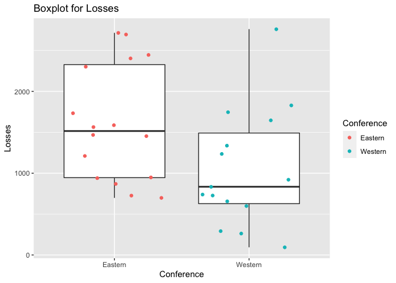

Project 1
================
Zichang Xiang
6/16/2021

-   [Reading and summarizing data from NHL
    API](#reading-and-summarizing-data-from-nhl-api)
-   [Functions to contact the NHL records
    API](#functions-to-contact-the-nhl-records-api)
-   [Function to contact the NHL stats
    API](#function-to-contact-the-nhl-stats-api)
-   [Wrapper function to call other
    functions](#wrapper-function-to-call-other-functions)
-   [Basic exploratory data analysis](#basic-exploratory-data-analysis)

### Reading and summarizing data from NHL API

#### Required Packages

jsonlite, RCurl, rmarkdown, httr, and ggplot2

``` r
#load the required packages
library(rmarkdown)
library(dplyr)
```

    ## 
    ## Attaching package: 'dplyr'

    ## The following objects are masked from 'package:stats':
    ## 
    ##     filter, lag

    ## The following objects are masked from 'package:base':
    ## 
    ##     intersect, setdiff, setequal, union

``` r
library(jsonlite)
library(RCurl)
library(httr)
library(ggplot2)
```

### Functions to contact the NHL records API

#### Function to return franchise

``` r
#retrieve the info and convert to a list
get_franchise <- GET("https://records.nhl.com/site/api/franchise")
franchise_cont <- content(get_franchise, "text", encoding = "UTF-8")
franchise_json<- fromJSON(franchise_cont, flatten = TRUE)
franchise_list <-as_tibble(franchise_json$data)
#create function franchise
franchise <- function(name) {
  if (is.null(name)){
  return(franchise_list)
  }else if (is.character(name)){
  return(franchise_list %>% 
           filter(fullName == name | teamAbbrev == name | teamCommonName == name |
                    teamPlaceName == name))
  }else
  return(franchise_list %>% filter(mostRecentTeamId == name))
}
#try to use function franchise
franchise(NULL)
```

    ## # A tibble: 39 x 8
    ##       id firstSeasonId fullName         lastSeasonId mostRecentTeamId teamAbbrev
    ##    <int>         <int> <chr>                   <int>            <int> <chr>     
    ##  1     1      19171918 Montréal Canadi…           NA                8 MTL       
    ##  2     2      19171918 Montreal Wander…     19171918               41 MWN       
    ##  3     3      19171918 St. Louis Eagles     19341935               45 SLE       
    ##  4     4      19191920 Hamilton Tigers      19241925               37 HAM       
    ##  5     5      19171918 Toronto Maple L…           NA               10 TOR       
    ##  6     6      19241925 Boston Bruins              NA                6 BOS       
    ##  7     7      19241925 Montreal Maroons     19371938               43 MMR       
    ##  8     8      19251926 Brooklyn Americ…     19411942               51 BRK       
    ##  9     9      19251926 Philadelphia Qu…     19301931               39 QUA       
    ## 10    10      19261927 New York Rangers           NA                3 NYR       
    ## # … with 29 more rows, and 2 more variables: teamCommonName <chr>,
    ## #   teamPlaceName <chr>

#### Function to return total stats for every franchise

``` r
#retrieve info and convert to a list
get_total <- GET("https://records.nhl.com/site/api/franchise-team-totals")
total_cont <- content(get_total, "text", encoding = "UTF-8")
total_json<- fromJSON(total_cont, flatten = TRUE)
total_list <-as_tibble(total_json$data)
#create function team_totals
team_totals <- function(name) {
  if (is.null(name)){
  return(total_list)
  }else if (is.character(name)){
  return(total_list %>% filter(teamName == name | triCode == name))
  }else
  return(total_list %>% filter(franchiseId == name) )
}

#try to use function team_totals
team_totals("MTL")
```

    ## # A tibble: 2 x 30
    ##      id activeFranchise firstSeasonId franchiseId gameTypeId gamesPlayed
    ##   <int>           <int>         <int>       <int>      <int>       <int>
    ## 1    15               1      19171918           1          3         773
    ## 2    16               1      19171918           1          2        6787
    ## # … with 24 more variables: goalsAgainst <int>, goalsFor <int>,
    ## #   homeLosses <int>, homeOvertimeLosses <int>, homeTies <int>, homeWins <int>,
    ## #   lastSeasonId <int>, losses <int>, overtimeLosses <int>,
    ## #   penaltyMinutes <int>, pointPctg <dbl>, points <int>, roadLosses <int>,
    ## #   roadOvertimeLosses <int>, roadTies <int>, roadWins <int>,
    ## #   shootoutLosses <int>, shootoutWins <int>, shutouts <int>, teamId <int>,
    ## #   teamName <chr>, ties <int>, triCode <chr>, wins <int>

``` r
team_totals(NULL)
```

    ## # A tibble: 105 x 30
    ##       id activeFranchise firstSeasonId franchiseId gameTypeId gamesPlayed
    ##    <int>           <int>         <int>       <int>      <int>       <int>
    ##  1     1               1      19821983          23          2        2993
    ##  2     2               1      19821983          23          3         257
    ##  3     3               1      19721973          22          2        3788
    ##  4     4               1      19721973          22          3         309
    ##  5     5               1      19261927          10          2        6560
    ##  6     6               1      19261927          10          3         518
    ##  7     7               1      19671968          16          3         449
    ##  8     8               1      19671968          16          2        4171
    ##  9     9               1      19671968          17          2        4171
    ## 10    10               1      19671968          17          3         391
    ## # … with 95 more rows, and 24 more variables: goalsAgainst <int>,
    ## #   goalsFor <int>, homeLosses <int>, homeOvertimeLosses <int>, homeTies <int>,
    ## #   homeWins <int>, lastSeasonId <int>, losses <int>, overtimeLosses <int>,
    ## #   penaltyMinutes <int>, pointPctg <dbl>, points <int>, roadLosses <int>,
    ## #   roadOvertimeLosses <int>, roadTies <int>, roadWins <int>,
    ## #   shootoutLosses <int>, shootoutWins <int>, shutouts <int>, teamId <int>,
    ## #   teamName <chr>, ties <int>, triCode <chr>, wins <int>

#### Function to return season records

``` r
#create function season
season <- function(name) {
  if (is.null(name)){
    base_url <- paste0("https://records.nhl.com/site/api/franchise-season-records")
    get_season <- GET(base_url)
    season_cont <- content(get_season, "text", encoding = "UTF-8")
    season_json <- fromJSON(season_cont, flatten = TRUE)
    season_list <- as_tibble(season_json$data)
  return(season_list)
  }else if (is.numeric(name)){
    base_url <- paste0("https://records.nhl.com/site/api/franchise-season-records?cayenneExp=franchiseId=", name)
    get_season <- GET(base_url)
    season_cont <- content(get_season, "text", encoding = "UTF-8")
    season_json <- fromJSON(season_cont, flatten = TRUE)
    season_list <- as_tibble(season_json$data)
  return(season_list)
  }else{
    get_season <- GET("https://records.nhl.com/site/api/franchise-season-records")
    season_cont <- content(get_season, "text", encoding = "UTF-8")
    season_json <- fromJSON(season_cont, flatten = TRUE)
    season_list <- as_tibble(season_json$data)
  return(season_list %>% filter(franchiseName == name))
  }
}

#try to use function season
season("Montréal Canadiens")
```

    ## # A tibble: 1 x 57
    ##      id fewestGoals fewestGoalsAgainst fewestGoalsAgainstSeas… fewestGoalsSeaso…
    ##   <int>       <int>              <int> <chr>                   <chr>            
    ## 1     8         155                131 1955-56 (70)            1952-53 (70)     
    ## # … with 52 more variables: fewestLosses <int>, fewestLossesSeasons <chr>,
    ## #   fewestPoints <int>, fewestPointsSeasons <chr>, fewestTies <int>,
    ## #   fewestTiesSeasons <chr>, fewestWins <int>, fewestWinsSeasons <chr>,
    ## #   franchiseId <int>, franchiseName <chr>, homeLossStreak <int>,
    ## #   homeLossStreakDates <chr>, homePointStreak <int>,
    ## #   homePointStreakDates <chr>, homeWinStreak <int>, homeWinStreakDates <chr>,
    ## #   homeWinlessStreak <int>, homeWinlessStreakDates <chr>, lossStreak <int>,
    ## #   lossStreakDates <chr>, mostGameGoals <int>, mostGameGoalsDates <chr>,
    ## #   mostGoals <int>, mostGoalsAgainst <int>, mostGoalsAgainstSeasons <chr>,
    ## #   mostGoalsSeasons <chr>, mostLosses <int>, mostLossesSeasons <chr>,
    ## #   mostPenaltyMinutes <int>, mostPenaltyMinutesSeasons <chr>,
    ## #   mostPoints <int>, mostPointsSeasons <chr>, mostShutouts <int>,
    ## #   mostShutoutsSeasons <chr>, mostTies <int>, mostTiesSeasons <chr>,
    ## #   mostWins <int>, mostWinsSeasons <chr>, pointStreak <int>,
    ## #   pointStreakDates <chr>, roadLossStreak <int>, roadLossStreakDates <chr>,
    ## #   roadPointStreak <int>, roadPointStreakDates <chr>, roadWinStreak <int>,
    ## #   roadWinStreakDates <chr>, roadWinlessStreak <int>,
    ## #   roadWinlessStreakDates <chr>, winStreak <int>, winStreakDates <chr>,
    ## #   winlessStreak <int>, winlessStreakDates <chr>

``` r
season(NULL)
```

    ## # A tibble: 39 x 57
    ##       id fewestGoals fewestGoalsAgain… fewestGoalsAgainstS… fewestGoalsSeasons  
    ##    <int>       <int>             <int> <chr>                <chr>               
    ##  1     1         174               164 2003-04 (82)         2010-11 (82)        
    ##  2     2         170               190 1975-76 (80)         1972-73 (78)        
    ##  3     3         150               177 1970-71 (78)         1954-55 (70)        
    ##  4     4         173               164 1973-74 (78)         1967-68 (74)        
    ##  5     5         182               188 1997-98 (82)         1969-70 (76)        
    ##  6     6         147               172 1952-53 (70)         1955-56 (70)        
    ##  7     7         157               175 1998-99 (82)         2013-14 (82)        
    ##  8     8         155               131 1955-56 (70)         1952-53 (70)        
    ##  9     9         191               179 1998-99 (82)         1995-96 (82), 2019-…
    ## 10    10         147               131 1953-54 (70)         1954-55 (70)        
    ## # … with 29 more rows, and 52 more variables: fewestLosses <int>,
    ## #   fewestLossesSeasons <chr>, fewestPoints <int>, fewestPointsSeasons <chr>,
    ## #   fewestTies <int>, fewestTiesSeasons <chr>, fewestWins <int>,
    ## #   fewestWinsSeasons <chr>, franchiseId <int>, franchiseName <chr>,
    ## #   homeLossStreak <int>, homeLossStreakDates <chr>, homePointStreak <int>,
    ## #   homePointStreakDates <chr>, homeWinStreak <int>, homeWinStreakDates <chr>,
    ## #   homeWinlessStreak <int>, homeWinlessStreakDates <chr>, lossStreak <int>,
    ## #   lossStreakDates <chr>, mostGameGoals <int>, mostGameGoalsDates <chr>,
    ## #   mostGoals <int>, mostGoalsAgainst <int>, mostGoalsAgainstSeasons <chr>,
    ## #   mostGoalsSeasons <chr>, mostLosses <int>, mostLossesSeasons <chr>,
    ## #   mostPenaltyMinutes <int>, mostPenaltyMinutesSeasons <chr>,
    ## #   mostPoints <int>, mostPointsSeasons <chr>, mostShutouts <int>,
    ## #   mostShutoutsSeasons <chr>, mostTies <int>, mostTiesSeasons <chr>,
    ## #   mostWins <int>, mostWinsSeasons <chr>, pointStreak <int>,
    ## #   pointStreakDates <chr>, roadLossStreak <int>, roadLossStreakDates <chr>,
    ## #   roadPointStreak <int>, roadPointStreakDates <chr>, roadWinStreak <int>,
    ## #   roadWinStreakDates <chr>, roadWinlessStreak <int>,
    ## #   roadWinlessStreakDates <chr>, winStreak <int>, winStreakDates <chr>,
    ## #   winlessStreak <int>, winlessStreakDates <chr>

#### Function to return goalie records

``` r
#create function goalie
goalie <- function(name) {
  if (is.null(name)){
    base_url <- paste0("https://records.nhl.com/site/api/franchise-goalie-records")
    get_goalie <- GET(base_url)
    goalie_cont <- content(get_goalie, "text", encoding = "UTF-8")
    goalie_json <- fromJSON(goalie_cont, flatten = TRUE)
    goalie_list <- as_tibble(goalie_json$data)
  return(goalie_list)
  }else if (is.numeric(name)){
    base_url <- paste0("https://records.nhl.com/site/api/franchise-goalie-records?cayenneExp=franchiseId=", name)
    get_goalie <- GET(base_url)
    goalie_cont <- content(get_goalie, "text", encoding = "UTF-8")
    goalie_json <- fromJSON(goalie_cont, flatten = TRUE)
    goalie_list <- as_tibble(goalie_json$data)
  return(goalie_list %>% filter(franchiseId == name))
  }else{
    get_goalie <- GET("https://records.nhl.com/site/api/franchise-goalie-records")
    goalie_cont <- content(get_goalie, "text", encoding = "UTF-8")
    goalie_json <- fromJSON(goalie_cont, flatten = TRUE)
    goalie_list <- as_tibble(goalie_json$data)
  return(goalie_list %>% filter(franchiseName == name | lastName == name | 
                                    firstName == name))
  }
}

#try to use function goalie
goalie(1)
```

    ## # A tibble: 38 x 29
    ##       id activePlayer firstName franchiseId franchiseName gameTypeId gamesPlayed
    ##    <int> <lgl>        <chr>           <int> <chr>              <int>       <int>
    ##  1  1182 FALSE        Ken                 1 Montréal Can…          2         397
    ##  2   414 FALSE        Stephane            1 Montréal Can…          2           2
    ##  3   437 FALSE        Jeff                1 Montréal Can…          2         161
    ##  4   450 FALSE        Brian               1 Montréal Can…          2         141
    ##  5   457 FALSE        Denis               1 Montréal Can…          2          86
    ##  6   469 FALSE        Pat                 1 Montréal Can…          2          40
    ##  7   511 FALSE        Roland              1 Montréal Can…          2           9
    ##  8   527 FALSE        Andy                1 Montréal Can…          2          42
    ##  9   549 FALSE        Lorne               1 Montréal Can…          2          47
    ## 10   559 FALSE        Abbie               1 Montréal Can…          2           1
    ## # … with 28 more rows, and 22 more variables: lastName <chr>, losses <int>,
    ## #   mostGoalsAgainstDates <chr>, mostGoalsAgainstOneGame <int>,
    ## #   mostSavesDates <chr>, mostSavesOneGame <int>, mostShotsAgainstDates <chr>,
    ## #   mostShotsAgainstOneGame <int>, mostShutoutsOneSeason <int>,
    ## #   mostShutoutsSeasonIds <chr>, mostWinsOneSeason <int>,
    ## #   mostWinsSeasonIds <chr>, overtimeLosses <int>, playerId <int>,
    ## #   positionCode <chr>, rookieGamesPlayed <int>, rookieShutouts <int>,
    ## #   rookieWins <int>, seasons <int>, shutouts <int>, ties <int>, wins <int>

``` r
goalie(NULL)
```

    ## # A tibble: 1,078 x 29
    ##       id activePlayer firstName franchiseId franchiseName gameTypeId gamesPlayed
    ##    <int> <lgl>        <chr>           <int> <chr>              <int>       <int>
    ##  1   235 FALSE        Don                15 Dallas Stars           2         315
    ##  2   236 FALSE        Bob                28 Arizona Coyo…          2         281
    ##  3   237 FALSE        Tony               11 Chicago Blac…          2         873
    ##  4   238 FALSE        Grant              25 Edmonton Oil…          2         423
    ##  5   239 FALSE        Ron                16 Philadelphia…          2         489
    ##  6   240 FALSE        Curtis             18 St. Louis Bl…          2         280
    ##  7   241 FALSE        Olie               24 Washington C…          2         711
    ##  8   242 FALSE        Mike               18 St. Louis Bl…          2         347
    ##  9   243 FALSE        Kirk               20 Vancouver Ca…          2         516
    ## 10   244 FALSE        Gilles             13 Cleveland Ba…          2         250
    ## # … with 1,068 more rows, and 22 more variables: lastName <chr>, losses <int>,
    ## #   mostGoalsAgainstDates <chr>, mostGoalsAgainstOneGame <int>,
    ## #   mostSavesDates <chr>, mostSavesOneGame <int>, mostShotsAgainstDates <chr>,
    ## #   mostShotsAgainstOneGame <int>, mostShutoutsOneSeason <int>,
    ## #   mostShutoutsSeasonIds <chr>, mostWinsOneSeason <int>,
    ## #   mostWinsSeasonIds <chr>, overtimeLosses <int>, playerId <int>,
    ## #   positionCode <chr>, rookieGamesPlayed <int>, rookieShutouts <int>,
    ## #   rookieWins <int>, seasons <int>, shutouts <int>, ties <int>, wins <int>

#### Function to return skater records

``` r
#create function skater
skater <- function(name) {
  if (is.null(name)){
    base_url <- paste0("https://records.nhl.com/site/api/franchise-skater-records")
    get_skater <- GET(base_url)
    skater_cont <- content(get_skater, "text", encoding = "UTF-8")
    skater_json <- fromJSON(skater_cont, flatten = TRUE)
    skater_list <- as_tibble(skater_json$data)
  return(skater_list)
  }else if (is.numeric(name)){
    base_url <- paste0("https://records.nhl.com/site/api/franchise-skater-records?cayenneExp=franchiseId=", name)
    get_skater <- GET(base_url)
    skater_cont <- content(get_skater, "text", encoding = "UTF-8")
    skater_json <- fromJSON(skater_cont, flatten = TRUE)
    skater_list <- as_tibble(skater_json$data)
  return(skater_list %>% filter(franchiseId == name))
  }else{
    get_skater<- GET("https://records.nhl.com/site/api/franchise-skater-records")
    skater_cont <- content(get_skater, "text", encoding = "UTF-8")
    skater_json <- fromJSON(skater_cont, flatten = TRUE)
    skater_list <- as_tibble(skater_json$data)
  return(skater_list %>% filter(franchiseName == name | lastName==name | 
                                    firstName == name))
  }
}

#try to use function skater
skater(1)
```

    ## # A tibble: 800 x 31
    ##       id activePlayer assists firstName franchiseId franchiseName     gameTypeId
    ##    <int> <lgl>          <int> <chr>           <int> <chr>                  <int>
    ##  1 17199 FALSE              0 Reg                 1 Montréal Canadie…          2
    ##  2 17223 FALSE              2 Art                 1 Montréal Canadie…          2
    ##  3 17272 FALSE              0 Dave                1 Montréal Canadie…          2
    ##  4 17351 FALSE              0 Ossie               1 Montréal Canadie…          2
    ##  5 17389 FALSE              0 Ron                 1 Montréal Canadie…          2
    ##  6 17440 FALSE              0 Jimmy               1 Montréal Canadie…          2
    ##  7 17484 FALSE              0 Max                 1 Montréal Canadie…          2
    ##  8 17508 FALSE              0 Bob                 1 Montréal Canadie…          2
    ##  9 17544 FALSE              0 Garry               1 Montréal Canadie…          2
    ## 10 17623 FALSE              0 Conrad              1 Montréal Canadie…          2
    ## # … with 790 more rows, and 24 more variables: gamesPlayed <int>, goals <int>,
    ## #   lastName <chr>, mostAssistsGameDates <chr>, mostAssistsOneGame <int>,
    ## #   mostAssistsOneSeason <int>, mostAssistsSeasonIds <chr>,
    ## #   mostGoalsGameDates <chr>, mostGoalsOneGame <int>, mostGoalsOneSeason <int>,
    ## #   mostGoalsSeasonIds <chr>, mostPenaltyMinutesOneSeason <int>,
    ## #   mostPenaltyMinutesSeasonIds <chr>, mostPointsGameDates <chr>,
    ## #   mostPointsOneGame <int>, mostPointsOneSeason <int>,
    ## #   mostPointsSeasonIds <chr>, penaltyMinutes <int>, playerId <int>,
    ## #   points <int>, positionCode <chr>, rookieGamesPlayed <int>,
    ## #   rookiePoints <int>, seasons <int>

``` r
skater(NULL)
```

    ## # A tibble: 17,209 x 31
    ##       id activePlayer assists firstName franchiseId franchiseName     gameTypeId
    ##    <int> <lgl>          <int> <chr>           <int> <chr>                  <int>
    ##  1 16888 FALSE            417 George              5 Toronto Maple Le…          2
    ##  2 16889 FALSE              0 Billy               2 Montreal Wandere…          2
    ##  3 16890 FALSE            794 Johnny              6 Boston Bruins              2
    ##  4 16891 FALSE            712 Jean                1 Montréal Canadie…          2
    ##  5 16892 FALSE           1111 Ray                 6 Boston Bruins              2
    ##  6 16893 FALSE             33 Harold              9 Philadelphia Qua…          2
    ##  7 16894 FALSE             13 Herb                9 Philadelphia Qua…          2
    ##  8 16895 FALSE            852 Bobby              16 Philadelphia Fly…          2
    ##  9 16896 FALSE            142 Ken                23 New Jersey Devils          2
    ## 10 16897 FALSE              0 Gerry               2 Montreal Wandere…          2
    ## # … with 17,199 more rows, and 24 more variables: gamesPlayed <int>,
    ## #   goals <int>, lastName <chr>, mostAssistsGameDates <chr>,
    ## #   mostAssistsOneGame <int>, mostAssistsOneSeason <int>,
    ## #   mostAssistsSeasonIds <chr>, mostGoalsGameDates <chr>,
    ## #   mostGoalsOneGame <int>, mostGoalsOneSeason <int>, mostGoalsSeasonIds <chr>,
    ## #   mostPenaltyMinutesOneSeason <int>, mostPenaltyMinutesSeasonIds <chr>,
    ## #   mostPointsGameDates <chr>, mostPointsOneGame <int>,
    ## #   mostPointsOneSeason <int>, mostPointsSeasonIds <chr>, penaltyMinutes <int>,
    ## #   playerId <int>, points <int>, positionCode <chr>, rookieGamesPlayed <int>,
    ## #   rookiePoints <int>, seasons <int>

#### Function to return detail records

``` r
#create function detail
detail <- function(name) {
  if (is.null(name)){
    base_url <- paste0("https://records.nhl.com/site/api/franchise-detail?")
    get_detail <- GET(base_url)
    detail_cont <- content(get_detail, "text", encoding = "UTF-8")
    detail_json <- fromJSON(detail_cont, flatten = TRUE)
    detail_list <- as_tibble(detail_json$data)
  return(detail_list)  
  }else if (is.numeric(name)){
    base_url <- paste0("https://records.nhl.com/site/api/franchise-detail?cayenneExp=mostRecentTeamId=", name)
    get_detail <- GET(base_url)
    detail_cont <- content(get_detail, "text", encoding = "UTF-8")
    detail_json <- fromJSON(detail_cont, flatten = TRUE)
    detail_list <- as_tibble(detail_json$data)
  return(detail_list %>% filter(mostRecentTeamId == name))
  }else{
    get_detail <- GET("https://records.nhl.com/site/api/franchise-detail")
    detail_cont <- content(get_detail, "text", encoding = "UTF-8")
    detail_json <- fromJSON(detail_cont, flatten = TRUE)
    detail_list <- as_tibble(detail_json$data)
  return(detail_list %>% filter(teamAbbrev == name | teamFullName == name))
  }
}

#try to use function detail
detail("Vancouver Canucks")
```

    ## # A tibble: 1 x 13
    ##      id active captainHistory     coachingHistory     dateAwarded  directoryUrl 
    ##   <int> <lgl>  <chr>              <chr>               <chr>        <chr>        
    ## 1    20 TRUE   "<ul class=\"stri… "<ul class=\"strip… 1970-05-22T… https://www.…
    ## # … with 7 more variables: firstSeasonId <int>, generalManagerHistory <chr>,
    ## #   heroImageUrl <chr>, mostRecentTeamId <int>, retiredNumbersSummary <chr>,
    ## #   teamAbbrev <chr>, teamFullName <chr>

``` r
detail(NULL)
```

    ## # A tibble: 39 x 13
    ##       id active captainHistory     coachingHistory     dateAwarded directoryUrl 
    ##    <int> <lgl>  <chr>              <chr>               <chr>       <chr>        
    ##  1     1 TRUE   "<ul class=\"stri… "<ul class=\"strip… 1917-11-26… https://www.…
    ##  2     2 FALSE   <NA>               <NA>               1917-11-26… <NA>         
    ##  3     3 FALSE   <NA>               <NA>               1917-11-26… <NA>         
    ##  4     4 FALSE   <NA>               <NA>               1917-11-26… <NA>         
    ##  5     5 TRUE   "<ul class=\"stri… "<ul class=\"strip… 1917-11-26… https://www.…
    ##  6     6 TRUE   "<ul class=\"stri… "<ul class=\"strip… 1924-11-01… https://www.…
    ##  7     7 FALSE   <NA>               <NA>               1924-11-01… <NA>         
    ##  8     8 FALSE   <NA>               <NA>               1925-09-22… <NA>         
    ##  9     9 FALSE   <NA>               <NA>               1925-11-07… <NA>         
    ## 10    10 TRUE   "<ul class=\"stri… "<ul class=\"strip… 1926-05-15… https://www.…
    ## # … with 29 more rows, and 7 more variables: firstSeasonId <int>,
    ## #   generalManagerHistory <chr>, heroImageUrl <chr>, mostRecentTeamId <int>,
    ## #   retiredNumbersSummary <chr>, teamAbbrev <chr>, teamFullName <chr>

### Function to contact the NHL stats API

``` r
#create function stats
stats <- function(name) {
  if (is.null(name)){
    full_url <- paste0("https://statsapi.web.nhl.com/api/v1/teams",
                       "?expand=team.stats")
  }else{full_url <- paste0("https://statsapi.web.nhl.com/api/v1/teams/", name,
                           "/?expand=team.stats")}
    get_stats <- GET(full_url)
    stats_cont <- content(get_stats, "text", encoding = "UTF-8")
    stats_json <- fromJSON(stats_cont, flatten = TRUE)
    stats_list <- as_tibble(stats_json$teams)
  return(stats_list)
}

#try to use function stats
stats(NULL)
```

    ## # A tibble: 32 x 28
    ##       id name       link      abbreviation teamName locationName firstYearOfPlay
    ##    <int> <chr>      <chr>     <chr>        <chr>    <chr>        <chr>          
    ##  1     1 New Jerse… /api/v1/… NJD          Devils   New Jersey   1982           
    ##  2     2 New York … /api/v1/… NYI          Islande… New York     1972           
    ##  3     3 New York … /api/v1/… NYR          Rangers  New York     1926           
    ##  4     4 Philadelp… /api/v1/… PHI          Flyers   Philadelphia 1967           
    ##  5     5 Pittsburg… /api/v1/… PIT          Penguins Pittsburgh   1967           
    ##  6     6 Boston Br… /api/v1/… BOS          Bruins   Boston       1924           
    ##  7     7 Buffalo S… /api/v1/… BUF          Sabres   Buffalo      1970           
    ##  8     8 Montréal … /api/v1/… MTL          Canadie… Montréal     1909           
    ##  9     9 Ottawa Se… /api/v1/… OTT          Senators Ottawa       1990           
    ## 10    10 Toronto M… /api/v1/… TOR          Maple L… Toronto      1917           
    ## # … with 22 more rows, and 21 more variables: teamStats <list>,
    ## #   shortName <chr>, officialSiteUrl <chr>, franchiseId <int>, active <lgl>,
    ## #   venue.name <chr>, venue.link <chr>, venue.city <chr>, venue.id <int>,
    ## #   venue.timeZone.id <chr>, venue.timeZone.offset <int>,
    ## #   venue.timeZone.tz <chr>, division.id <int>, division.name <chr>,
    ## #   division.link <chr>, conference.id <int>, conference.name <chr>,
    ## #   conference.link <chr>, franchise.franchiseId <int>,
    ## #   franchise.teamName <chr>, franchise.link <chr>

### Wrapper function to call other functions

``` r
#create wrapper function to call other functions
wrapper <- function(fun, name){
  if (fun == "franchise"){
    return(franchise(name))
  }else if (fun == "team_totals"){
    return(team_totals(name))
  }else if (fun == "season"){
    return(season(name))
  }else if (fun == "goalie"){
    return(goalie(name))
  }else if (fun == "skater"){
    return(skater(name))
  }else if (fun == "detail"){
    return(detail(name))
  }else if (fun == "stats"){
    return(stats(name))
  }else{
    stop("Type the correct function!")
  }
}

#try to use function wrapper
wrapper("stats", NULL)
```

    ## # A tibble: 32 x 28
    ##       id name       link      abbreviation teamName locationName firstYearOfPlay
    ##    <int> <chr>      <chr>     <chr>        <chr>    <chr>        <chr>          
    ##  1     1 New Jerse… /api/v1/… NJD          Devils   New Jersey   1982           
    ##  2     2 New York … /api/v1/… NYI          Islande… New York     1972           
    ##  3     3 New York … /api/v1/… NYR          Rangers  New York     1926           
    ##  4     4 Philadelp… /api/v1/… PHI          Flyers   Philadelphia 1967           
    ##  5     5 Pittsburg… /api/v1/… PIT          Penguins Pittsburgh   1967           
    ##  6     6 Boston Br… /api/v1/… BOS          Bruins   Boston       1924           
    ##  7     7 Buffalo S… /api/v1/… BUF          Sabres   Buffalo      1970           
    ##  8     8 Montréal … /api/v1/… MTL          Canadie… Montréal     1909           
    ##  9     9 Ottawa Se… /api/v1/… OTT          Senators Ottawa       1990           
    ## 10    10 Toronto M… /api/v1/… TOR          Maple L… Toronto      1917           
    ## # … with 22 more rows, and 21 more variables: teamStats <list>,
    ## #   shortName <chr>, officialSiteUrl <chr>, franchiseId <int>, active <lgl>,
    ## #   venue.name <chr>, venue.link <chr>, venue.city <chr>, venue.id <int>,
    ## #   venue.timeZone.id <chr>, venue.timeZone.offset <int>,
    ## #   venue.timeZone.tz <chr>, division.id <int>, division.name <chr>,
    ## #   division.link <chr>, conference.id <int>, conference.name <chr>,
    ## #   conference.link <chr>, franchise.franchiseId <int>,
    ## #   franchise.teamName <chr>, franchise.link <chr>

``` r
wrapper("franchise", NULL)
```

    ## # A tibble: 39 x 8
    ##       id firstSeasonId fullName         lastSeasonId mostRecentTeamId teamAbbrev
    ##    <int>         <int> <chr>                   <int>            <int> <chr>     
    ##  1     1      19171918 Montréal Canadi…           NA                8 MTL       
    ##  2     2      19171918 Montreal Wander…     19171918               41 MWN       
    ##  3     3      19171918 St. Louis Eagles     19341935               45 SLE       
    ##  4     4      19191920 Hamilton Tigers      19241925               37 HAM       
    ##  5     5      19171918 Toronto Maple L…           NA               10 TOR       
    ##  6     6      19241925 Boston Bruins              NA                6 BOS       
    ##  7     7      19241925 Montreal Maroons     19371938               43 MMR       
    ##  8     8      19251926 Brooklyn Americ…     19411942               51 BRK       
    ##  9     9      19251926 Philadelphia Qu…     19301931               39 QUA       
    ## 10    10      19261927 New York Rangers           NA                3 NYR       
    ## # … with 29 more rows, and 2 more variables: teamCommonName <chr>,
    ## #   teamPlaceName <chr>

### Basic exploratory data analysis

#### Combine data from two endpoints

``` r
#create new data frame goalie_all
goalie_all <- goalie(NULL)[ , c(1:8)]
goalie_all <- goalie_all %>% mutate(Type = "goalie")
#view the data frame
goalie_all
```

    ## # A tibble: 1,078 x 9
    ##       id activePlayer firstName franchiseId franchiseName gameTypeId gamesPlayed
    ##    <int> <lgl>        <chr>           <int> <chr>              <int>       <int>
    ##  1   235 FALSE        Don                15 Dallas Stars           2         315
    ##  2   236 FALSE        Bob                28 Arizona Coyo…          2         281
    ##  3   237 FALSE        Tony               11 Chicago Blac…          2         873
    ##  4   238 FALSE        Grant              25 Edmonton Oil…          2         423
    ##  5   239 FALSE        Ron                16 Philadelphia…          2         489
    ##  6   240 FALSE        Curtis             18 St. Louis Bl…          2         280
    ##  7   241 FALSE        Olie               24 Washington C…          2         711
    ##  8   242 FALSE        Mike               18 St. Louis Bl…          2         347
    ##  9   243 FALSE        Kirk               20 Vancouver Ca…          2         516
    ## 10   244 FALSE        Gilles             13 Cleveland Ba…          2         250
    ## # … with 1,068 more rows, and 2 more variables: lastName <chr>, Type <chr>

``` r
#create new data frame skater_all
skater_all <-skater(NULL)[, c(1:2, 4:8, 10)]
skater_all <- skater_all %>% mutate(Type = "skater")
#view the data frame
skater_all
```

    ## # A tibble: 17,209 x 9
    ##       id activePlayer firstName franchiseId franchiseName gameTypeId gamesPlayed
    ##    <int> <lgl>        <chr>           <int> <chr>              <int>       <int>
    ##  1 16888 FALSE        George              5 Toronto Mapl…          2        1188
    ##  2 16889 FALSE        Billy               2 Montreal Wan…          2           2
    ##  3 16890 FALSE        Johnny              6 Boston Bruins          2        1436
    ##  4 16891 FALSE        Jean                1 Montréal Can…          2        1125
    ##  5 16892 FALSE        Ray                 6 Boston Bruins          2        1518
    ##  6 16893 FALSE        Harold              9 Philadelphia…          2         216
    ##  7 16894 FALSE        Herb                9 Philadelphia…          2         216
    ##  8 16895 FALSE        Bobby              16 Philadelphia…          2        1144
    ##  9 16896 FALSE        Ken                23 New Jersey D…          2        1283
    ## 10 16897 FALSE        Gerry               2 Montreal Wan…          2           4
    ## # … with 17,199 more rows, and 2 more variables: lastName <chr>, Type <chr>

``` r
#create new data frame goalie_skater_all
goalie_skater_all <- rbind(goalie_all, skater_all)
goalie_skater_all <- goalie_skater_all[order(goalie_skater_all$id), ]
#view the data frame
goalie_skater_all
```

    ## # A tibble: 18,287 x 9
    ##       id activePlayer firstName franchiseId franchiseName gameTypeId gamesPlayed
    ##    <int> <lgl>        <chr>           <int> <chr>              <int>       <int>
    ##  1   235 FALSE        Don                15 Dallas Stars           2         315
    ##  2   236 FALSE        Bob                28 Arizona Coyo…          2         281
    ##  3   237 FALSE        Tony               11 Chicago Blac…          2         873
    ##  4   238 FALSE        Grant              25 Edmonton Oil…          2         423
    ##  5   239 FALSE        Ron                16 Philadelphia…          2         489
    ##  6   240 FALSE        Curtis             18 St. Louis Bl…          2         280
    ##  7   241 FALSE        Olie               24 Washington C…          2         711
    ##  8   242 FALSE        Mike               18 St. Louis Bl…          2         347
    ##  9   243 FALSE        Kirk               20 Vancouver Ca…          2         516
    ## 10   244 FALSE        Gilles             13 Cleveland Ba…          2         250
    ## # … with 18,277 more rows, and 2 more variables: lastName <chr>, Type <chr>

#### Create at least two new variables

Here we create three new variables loss\_rate, win\_rate, and tie\_rate

``` r
#create new data frame goalie_all
goalie_all <- goalie(NULL)[ , c(1:9, 28:29)]
#view the data frame
goalie_all
```

    ## # A tibble: 1,078 x 11
    ##       id activePlayer firstName franchiseId franchiseName gameTypeId gamesPlayed
    ##    <int> <lgl>        <chr>           <int> <chr>              <int>       <int>
    ##  1   235 FALSE        Don                15 Dallas Stars           2         315
    ##  2   236 FALSE        Bob                28 Arizona Coyo…          2         281
    ##  3   237 FALSE        Tony               11 Chicago Blac…          2         873
    ##  4   238 FALSE        Grant              25 Edmonton Oil…          2         423
    ##  5   239 FALSE        Ron                16 Philadelphia…          2         489
    ##  6   240 FALSE        Curtis             18 St. Louis Bl…          2         280
    ##  7   241 FALSE        Olie               24 Washington C…          2         711
    ##  8   242 FALSE        Mike               18 St. Louis Bl…          2         347
    ##  9   243 FALSE        Kirk               20 Vancouver Ca…          2         516
    ## 10   244 FALSE        Gilles             13 Cleveland Ba…          2         250
    ## # … with 1,068 more rows, and 4 more variables: lastName <chr>, losses <int>,
    ## #   ties <int>, wins <int>

``` r
#create three new variables loss_rate, win_rate, and tie_rate
goalie_all <- goalie_all %>% mutate(loss_rate = goalie_all$losses/goalie_all$gamesPlayed, 
                                    win_rate = goalie_all$wins/goalie_all$gamesPlayed, 
                                    tie_rate = goalie_all$ties/goalie_all$gamesPlayed)
#view the data frame
goalie_all
```

    ## # A tibble: 1,078 x 14
    ##       id activePlayer firstName franchiseId franchiseName gameTypeId gamesPlayed
    ##    <int> <lgl>        <chr>           <int> <chr>              <int>       <int>
    ##  1   235 FALSE        Don                15 Dallas Stars           2         315
    ##  2   236 FALSE        Bob                28 Arizona Coyo…          2         281
    ##  3   237 FALSE        Tony               11 Chicago Blac…          2         873
    ##  4   238 FALSE        Grant              25 Edmonton Oil…          2         423
    ##  5   239 FALSE        Ron                16 Philadelphia…          2         489
    ##  6   240 FALSE        Curtis             18 St. Louis Bl…          2         280
    ##  7   241 FALSE        Olie               24 Washington C…          2         711
    ##  8   242 FALSE        Mike               18 St. Louis Bl…          2         347
    ##  9   243 FALSE        Kirk               20 Vancouver Ca…          2         516
    ## 10   244 FALSE        Gilles             13 Cleveland Ba…          2         250
    ## # … with 1,068 more rows, and 7 more variables: lastName <chr>, losses <int>,
    ## #   ties <int>, wins <int>, loss_rate <dbl>, win_rate <dbl>, tie_rate <dbl>

#### Create contingency tables

Table 1 below shows the relationship between the type of player and the
number of active players. As we can see from the table, there are more
non-active players than active players. This is true for both goalies
and skaters.

In the second table, we can find the number of teams for each
combination of division and time zone. We can see from the table that
teams in division Honda West and in division Scotia North are from four
different time zones, while teams in division MassMutual East fall into
only one time zone EDT.

``` r
#create table to summarize the relationship between player type and the number of active players
table(goalie_skater_all$Type, goalie_skater_all$activePlayer)
```

    ##         
    ##          FALSE  TRUE
    ##   goalie   929   149
    ##   skater 15242  1967

``` r
#create table to summarize the relationship between divisions and timeZones
table(stats(NULL)$division.name, stats(NULL)$venue.timeZone.tz)
```

    ##                   
    ##                    CDT EDT MDT MST PDT
    ##   Discover Central   3   5   0   0   0
    ##   Honda West         2   0   1   1   4
    ##   MassMutual East    0   8   0   0   0
    ##   Scotia North       1   3   2   0   1

#### Create numerical summaries

``` r
#quantiles and mean for wins in regular season
totals_regular <- team_totals(NULL) %>% filter(gameTypeId ==2) 
summary(totals_regular$wins)
```

    ##    Min. 1st Qu.  Median    Mean 3rd Qu.    Max. 
    ##       1     113     678     929    1497    3473

``` r
#quantiles and mean for games played
goalie_skater_all %>% group_by(Type) %>% summarize(min = min(gamesPlayed), 
                                                   avg = round(mean(gamesPlayed),0), 
                                                   med = median(gamesPlayed), 
                                                   max = max(gamesPlayed))
```

    ## # A tibble: 2 x 5
    ##   Type     min   avg   med   max
    ##   <chr>  <int> <dbl> <dbl> <int>
    ## 1 goalie     1    89    38  1259
    ## 2 skater     1   117    54  1687

#### Creates plots

The bar plot below compares the number of players for each player type.
As we can see, non-active skaters are the most common, while active
goalies are the least common.

``` r
#create bar plot to compare number of players for each player type
g <- ggplot(goalie_skater_all, aes(x = Type))
g + geom_bar(aes(fill = as.factor(activePlayer)), position = "dodge") + 
  ggtitle("Numer of Players for Each Player Type") + 
  labs(x = "Player Type") + 
  scale_fill_discrete(name = "Active player")
```

<!-- -->

Below is a histogram of the distribution of numerical variable wins. The
plot shows that the probability of winning decreases as the number of
wins increases. In other words, it is harder to win more games.

``` r
#create histogram to present the distribution of numerical variable wins.
g <- ggplot(goalie_all, aes(x = wins, ..density..))
g + geom_histogram(bins = 150) +
  labs(x = "Wins", y = "Density") +
  ggtitle("Histogram for Wins") +
  geom_density(col = "red", lwd = 3, adjust = 0.4)
```

<!-- -->

Below is a boxplot showing the number of wins for each conference. The
Eastern conference has more wins.

``` r
#create a new dataset conf_totals
conference <- stats(NULL)[ , c("id", "conference.name")]
totals <- team_totals(NULL) %>% 
  filter(gameTypeId == 2, teamId %in% c(1:26, 28:30, 52:55)) %>% 
  select(c(14, 26, 27, 30))
totals <- totals %>% rename(id = teamId)
conference <- conference %>% rename(Conference = conference.name)
conf_totals<- merge(totals, conference, by = "id")
#view the dataset conf_totals
conf_totals
```

    ##    id losses              teamName wins Conference
    ## 1   1   1211     New Jersey Devils 1394    Eastern
    ## 2   2   1587    New York Islanders 1688    Eastern
    ## 3   3   2716      New York Rangers 2883    Eastern
    ## 4   4   1452   Philadelphia Flyers 2079    Eastern
    ## 5   5   1734   Pittsburgh Penguins 1903    Eastern
    ## 6   6   2403         Boston Bruins 3241    Eastern
    ## 7   7   1564        Buffalo Sabres 1805    Eastern
    ## 8   8   2302    Montréal Canadiens 3473    Eastern
    ## 9   9    940       Ottawa Senators  971    Eastern
    ## 10 10   2696   Toronto Maple Leafs 2873    Eastern
    ## 11 12    725   Carolina Hurricanes  827    Eastern
    ## 12 13    870      Florida Panthers  889    Eastern
    ## 13 14    947   Tampa Bay Lightning  985    Eastern
    ## 14 15   1467   Washington Capitals 1700    Eastern
    ## 15 16   2761    Chicago Blackhawks 2812    Western
    ## 16 17   2446     Detroit Red Wings 2891    Eastern
    ## 17 18    656   Nashville Predators  852    Western
    ## 18 19   1645       St. Louis Blues 1929    Western
    ## 19 20   1236        Calgary Flames 1497    Western
    ## 20 21    728    Colorado Avalanche 1007    Western
    ## 21 22   1337       Edmonton Oilers 1469    Western
    ## 22 23   1746     Vancouver Canucks 1649    Western
    ## 23 24    834         Anaheim Ducks  990    Western
    ## 24 25    738          Dallas Stars 1084    Western
    ## 25 26   1829     Los Angeles Kings 1754    Western
    ## 26 28    920       San Jose Sharks 1070    Western
    ## 27 29    698 Columbus Blue Jackets  678    Eastern
    ## 28 30    599        Minnesota Wild  759    Western
    ## 29 52    292         Winnipeg Jets  382    Western
    ## 30 53    262       Arizona Coyotes  214    Western
    ## 31 54     94  Vegas Golden Knights  173    Western

``` r
#create boxplot for number of wins for each conference
g <- ggplot(conf_totals, aes(x = Conference, y = wins)) 
g + geom_boxplot() + 
  geom_jitter(aes(color = Conference)) + 
  ggtitle("Boxplot for Wins") +
  labs(x = "Conference", y = "Wins")
```

<!-- -->

The scatterplot below illustrates how wins and losses are related. We
can see that more wins are accompanied by more losses. This is true for
both conferences.

``` r
#create scatter plot to show the relationship between wins and losses
g <- ggplot(conf_totals, aes(x = wins, y = losses, group = Conference)) 
g+ geom_point(aes(color = Conference), position = "jitter") + 
   geom_smooth(aes(group = Conference), method = lm, formula = y ~ x, col = "green") + 
   ggtitle("Wins vs Losses")
```

<!-- -->
