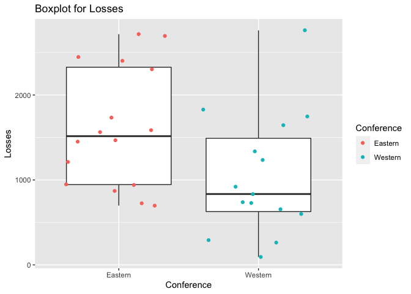

Project 1
================
Zichang Xiang
6/16/2021

-   [Reading and summarizing data from NHL
    API](#reading-and-summarizing-data-from-nhl-api)
-   [Functions to contact the NHL records
    API](#functions-to-contact-the-nhl-records-api)
-   [Function to contact the NHL stats
    API](#function-to-contact-the-nhl-stats-api)
-   [Wrapper function to call other
    functions](#wrapper-function-to-call-other-functions)
-   [Basic exploratory data analysis](#basic-exploratory-data-analysis)

### Reading and summarizing data from NHL API

#### Required Packages

rmarkdown, jsonlite, ggplot2, dplyr, knitr, tidyr, RCurl, httr

``` r
#load the required packages
library(rmarkdown)
library(jsonlite)
library(ggplot2)
library(dplyr)
library(knitr)
library(tidyr)
library(RCurl)
library(httr)
```

### Functions to contact the NHL records API

#### Function to return franchise

``` r
#retrieve the info and convert to a list
get_franchise  <- GET("https://records.nhl.com/site/api/franchise")
franchise_cont <- content(get_franchise, "text", encoding = "UTF-8")
franchise_json <- fromJSON(franchise_cont, flatten = TRUE)
franchise_list <- as_tibble(franchise_json$data)
franchise_list
```

    ## # A tibble: 39 x 8
    ##       id firstSeasonId fullName             lastSeasonId mostRecentTeamId teamAbbrev teamCommonName teamPlaceName
    ##    <int>         <int> <chr>                       <int>            <int> <chr>      <chr>          <chr>        
    ##  1     1      19171918 Montréal Canadiens             NA                8 MTL        Canadiens      Montréal     
    ##  2     2      19171918 Montreal Wanderers       19171918               41 MWN        Wanderers      Montreal     
    ##  3     3      19171918 St. Louis Eagles         19341935               45 SLE        Eagles         St. Louis    
    ##  4     4      19191920 Hamilton Tigers          19241925               37 HAM        Tigers         Hamilton     
    ##  5     5      19171918 Toronto Maple Leafs            NA               10 TOR        Maple Leafs    Toronto      
    ##  6     6      19241925 Boston Bruins                  NA                6 BOS        Bruins         Boston       
    ##  7     7      19241925 Montreal Maroons         19371938               43 MMR        Maroons        Montreal     
    ##  8     8      19251926 Brooklyn Americans       19411942               51 BRK        Americans      Brooklyn     
    ##  9     9      19251926 Philadelphia Quakers     19301931               39 QUA        Quakers        Philadelphia 
    ## 10    10      19261927 New York Rangers               NA                3 NYR        Rangers        New York     
    ## # … with 29 more rows

``` r
#create function franchise
franchise <- function(name) {
  if (is.null(name)){
    return(franchise_list)
  }else if (is.character(name)){
    return(franchise_list %>% 
           filter (fullName == name | teamAbbrev == name | teamCommonName == name |
                    teamPlaceName == name))
  }else if (is.numeric(name)){
    return(franchise_list %>% filter(mostRecentTeamId == name))
  }else{
    stop("Wrong input!")
  }
}

#try to use function franchise
franchise(8)
```

    ## # A tibble: 1 x 8
    ##      id firstSeasonId fullName           lastSeasonId mostRecentTeamId teamAbbrev teamCommonName teamPlaceName
    ##   <int>         <int> <chr>                     <int>            <int> <chr>      <chr>          <chr>        
    ## 1     1      19171918 Montréal Canadiens           NA                8 MTL        Canadiens      Montréal

``` r
franchise("Montréal Canadiens")
```

    ## # A tibble: 1 x 8
    ##      id firstSeasonId fullName           lastSeasonId mostRecentTeamId teamAbbrev teamCommonName teamPlaceName
    ##   <int>         <int> <chr>                     <int>            <int> <chr>      <chr>          <chr>        
    ## 1     1      19171918 Montréal Canadiens           NA                8 MTL        Canadiens      Montréal

#### Function to return total stats for every franchise

``` r
#retrieve info and convert to a list
get_total  <- GET("https://records.nhl.com/site/api/franchise-team-totals")
total_cont <- content(get_total, "text", encoding = "UTF-8")
total_json <- fromJSON(total_cont, flatten = TRUE)
total_list <- as_tibble(total_json$data)
total_list
```

    ## # A tibble: 105 x 30
    ##       id activeFranchise firstSeasonId franchiseId gameTypeId gamesPlayed goalsAgainst goalsFor homeLosses homeOvertimeLosses homeTies homeWins
    ##    <int>           <int>         <int>       <int>      <int>       <int>        <int>    <int>      <int>              <int>    <int>    <int>
    ##  1     1               1      19821983          23          2        2993         8902     8792        525                 85       96      790
    ##  2     2               1      19821983          23          3         257          634      697         53                  0       NA       74
    ##  3     3               1      19721973          22          2        3788        11907    12045        678                 84      170      963
    ##  4     4               1      19721973          22          3         310          899      986         53                  1       NA       95
    ##  5     5               1      19261927          10          2        6560        20020    20041       1143                 76      448     1614
    ##  6     6               1      19261927          10          3         518         1447     1404        104                  0        1      137
    ##  7     7               1      19671968          16          3         449         1332     1335         97                  0       NA      135
    ##  8     8               1      19671968          16          2        4171        12255    13690        584                 93      193     1216
    ##  9     9               1      19671968          17          2        4171        14049    13874        683                 60      205     1138
    ## 10    10               1      19671968          17          3         391         1131     1190         85                  0       NA      113
    ## # … with 95 more rows, and 18 more variables: lastSeasonId <int>, losses <int>, overtimeLosses <int>, penaltyMinutes <int>, pointPctg <dbl>,
    ## #   points <int>, roadLosses <int>, roadOvertimeLosses <int>, roadTies <int>, roadWins <int>, shootoutLosses <int>, shootoutWins <int>,
    ## #   shutouts <int>, teamId <int>, teamName <chr>, ties <int>, triCode <chr>, wins <int>

``` r
#create function total
total <- function(name) {
  if (is.null(name)){
    return(total_list)
  }else if (is.character(name)){
    return(total_list %>% filter(teamName == name | triCode == name))
  }else if (is.numeric(name)){
    return(total_list %>% filter(franchiseId == name) )
  }else{
    stop("Wrong input!")
  }
}

#try to use function total
total("MTL")
```

    ## # A tibble: 2 x 30
    ##      id activeFranchise firstSeasonId franchiseId gameTypeId gamesPlayed goalsAgainst goalsFor homeLosses homeOvertimeLosses homeTies homeWins
    ##   <int>           <int>         <int>       <int>      <int>       <int>        <int>    <int>      <int>              <int>    <int>    <int>
    ## 1    15               1      19171918           1          3         773         1959     2306        133                  0        3      258
    ## 2    16               1      19171918           1          2        6787        18260    21791        881                 95      381     2038
    ## # … with 18 more variables: lastSeasonId <int>, losses <int>, overtimeLosses <int>, penaltyMinutes <int>, pointPctg <dbl>, points <int>,
    ## #   roadLosses <int>, roadOvertimeLosses <int>, roadTies <int>, roadWins <int>, shootoutLosses <int>, shootoutWins <int>, shutouts <int>,
    ## #   teamId <int>, teamName <chr>, ties <int>, triCode <chr>, wins <int>

#### Function to return season records

``` r
#create data frame lookup including name and id
base_url    <- paste0("https://records.nhl.com/site/api/franchise-season-records")
get_season  <- GET(base_url)
season_cont <- content(get_season, "text", encoding = "UTF-8")
season_json <- fromJSON(season_cont, flatten = TRUE)
season_list <- as_tibble(season_json$data)
lookup <- season_list[,c(14,15)]
lookup
```

    ## # A tibble: 39 x 2
    ##    franchiseId franchiseName      
    ##          <int> <chr>              
    ##  1          23 New Jersey Devils  
    ##  2          22 New York Islanders 
    ##  3          10 New York Rangers   
    ##  4          16 Philadelphia Flyers
    ##  5          17 Pittsburgh Penguins
    ##  6           6 Boston Bruins      
    ##  7          19 Buffalo Sabres     
    ##  8           1 Montréal Canadiens 
    ##  9          30 Ottawa Senators    
    ## 10           5 Toronto Maple Leafs
    ## # … with 29 more rows

``` r
#create function season
season <- function(name) {
  if (is.null(name)){
    return(season_list)
  }else if (name %in% lookup$franchiseId){
    full_url <- paste0("https://records.nhl.com/site/api/franchise-season-records?cayenneExp=franchiseId=", name)
  }else if (name %in% lookup$franchiseName){
    id <- lookup %>% filter(franchiseName == name) %>% select(1)
    full_url <- paste0("https://records.nhl.com/site/api/franchise-season-records?cayenneExp=franchiseId=", id)
  }else{
    stop("Wrong input!")
  }
    get_season  <- GET(full_url)
    season_cont <- content(get_season, "text", encoding = "UTF-8")
    season_json <- fromJSON(season_cont, flatten = TRUE)
    season_list <- as_tibble(season_json$data)
    return(season_list)
}

#try to use function season
season(1)
```

    ## # A tibble: 1 x 57
    ##      id fewestGoals fewestGoalsAgain… fewestGoalsAgain… fewestGoalsSeas… fewestLosses fewestLossesSea… fewestPoints fewestPointsSea… fewestTies
    ##   <int>       <int>             <int> <chr>             <chr>                   <int> <chr>                   <int> <chr>                 <int>
    ## 1     8         155               131 1955-56 (70)      1952-53 (70)                8 1976-77 (80)               65 1950-51 (70)              5
    ## # … with 47 more variables: fewestTiesSeasons <chr>, fewestWins <int>, fewestWinsSeasons <chr>, franchiseId <int>, franchiseName <chr>,
    ## #   homeLossStreak <int>, homeLossStreakDates <chr>, homePointStreak <int>, homePointStreakDates <chr>, homeWinStreak <int>,
    ## #   homeWinStreakDates <chr>, homeWinlessStreak <int>, homeWinlessStreakDates <chr>, lossStreak <int>, lossStreakDates <chr>,
    ## #   mostGameGoals <int>, mostGameGoalsDates <chr>, mostGoals <int>, mostGoalsAgainst <int>, mostGoalsAgainstSeasons <chr>,
    ## #   mostGoalsSeasons <chr>, mostLosses <int>, mostLossesSeasons <chr>, mostPenaltyMinutes <int>, mostPenaltyMinutesSeasons <chr>,
    ## #   mostPoints <int>, mostPointsSeasons <chr>, mostShutouts <int>, mostShutoutsSeasons <chr>, mostTies <int>, mostTiesSeasons <chr>,
    ## #   mostWins <int>, mostWinsSeasons <chr>, pointStreak <int>, pointStreakDates <chr>, roadLossStreak <int>, roadLossStreakDates <chr>,
    ## #   roadPointStreak <int>, roadPointStreakDates <chr>, roadWinStreak <int>, roadWinStreakDates <chr>, roadWinlessStreak <int>,
    ## #   roadWinlessStreakDates <chr>, winStreak <int>, winStreakDates <chr>, winlessStreak <int>, winlessStreakDates <chr>

``` r
season("Montréal Canadiens")
```

    ## # A tibble: 1 x 57
    ##      id fewestGoals fewestGoalsAgain… fewestGoalsAgain… fewestGoalsSeas… fewestLosses fewestLossesSea… fewestPoints fewestPointsSea… fewestTies
    ##   <int>       <int>             <int> <chr>             <chr>                   <int> <chr>                   <int> <chr>                 <int>
    ## 1     8         155               131 1955-56 (70)      1952-53 (70)                8 1976-77 (80)               65 1950-51 (70)              5
    ## # … with 47 more variables: fewestTiesSeasons <chr>, fewestWins <int>, fewestWinsSeasons <chr>, franchiseId <int>, franchiseName <chr>,
    ## #   homeLossStreak <int>, homeLossStreakDates <chr>, homePointStreak <int>, homePointStreakDates <chr>, homeWinStreak <int>,
    ## #   homeWinStreakDates <chr>, homeWinlessStreak <int>, homeWinlessStreakDates <chr>, lossStreak <int>, lossStreakDates <chr>,
    ## #   mostGameGoals <int>, mostGameGoalsDates <chr>, mostGoals <int>, mostGoalsAgainst <int>, mostGoalsAgainstSeasons <chr>,
    ## #   mostGoalsSeasons <chr>, mostLosses <int>, mostLossesSeasons <chr>, mostPenaltyMinutes <int>, mostPenaltyMinutesSeasons <chr>,
    ## #   mostPoints <int>, mostPointsSeasons <chr>, mostShutouts <int>, mostShutoutsSeasons <chr>, mostTies <int>, mostTiesSeasons <chr>,
    ## #   mostWins <int>, mostWinsSeasons <chr>, pointStreak <int>, pointStreakDates <chr>, roadLossStreak <int>, roadLossStreakDates <chr>,
    ## #   roadPointStreak <int>, roadPointStreakDates <chr>, roadWinStreak <int>, roadWinStreakDates <chr>, roadWinlessStreak <int>,
    ## #   roadWinlessStreakDates <chr>, winStreak <int>, winStreakDates <chr>, winlessStreak <int>, winlessStreakDates <chr>

#### Function to return goalie records

``` r
#create data frame lookup
base_url <- paste0("https://records.nhl.com/site/api/franchise-goalie-records")
get_goalie  <- GET(base_url)
goalie_cont <- content(get_goalie, "text", encoding = "UTF-8")
goalie_json <- fromJSON(goalie_cont, flatten = TRUE)
goalie_list <- as_tibble(goalie_json$data)
lookup <- goalie_list[ , c(4, 5)]
lookup
```

    ## # A tibble: 1,078 x 2
    ##    franchiseId franchiseName      
    ##          <int> <chr>              
    ##  1          15 Dallas Stars       
    ##  2          28 Arizona Coyotes    
    ##  3          11 Chicago Blackhawks 
    ##  4          25 Edmonton Oilers    
    ##  5          16 Philadelphia Flyers
    ##  6          18 St. Louis Blues    
    ##  7          24 Washington Capitals
    ##  8          18 St. Louis Blues    
    ##  9          20 Vancouver Canucks  
    ## 10          13 Cleveland Barons   
    ## # … with 1,068 more rows

``` r
#create function goalie
goalie <- function(name) {
  if (is.null(name)){
    return(goalie_list)
  }else if (name %in% lookup$franchiseId){
    full_url <- paste0("https://records.nhl.com/site/api/franchise-goalie-records?cayenneExp=franchiseId=", name)
  }else if (name %in% lookup$franchiseName){
    id <- lookup %>% filter(franchiseName == name) %>% select(1) %>% unique()
    full_url <- paste0("https://records.nhl.com/site/api/franchise-goalie-records?cayenneExp=franchiseId=", id)
  }else{
    stop("Wrong input!")
  }
    get_goalie  <- GET(full_url)
    goalie_cont <- content(get_goalie, "text", encoding = "UTF-8")
    goalie_json <- fromJSON(goalie_cont, flatten = TRUE)
    goalie_list <- as_tibble(goalie_json$data)
  return(goalie_list)
}

#try to use function goalie
goalie(15)
```

    ## # A tibble: 37 x 29
    ##       id activePlayer firstName franchiseId franchiseName gameTypeId gamesPlayed lastName  losses mostGoalsAgainstDates       mostGoalsAgainst…
    ##    <int> <lgl>        <chr>           <int> <chr>              <int>       <int> <chr>      <int> <chr>                                   <int>
    ##  1   235 FALSE        Don                15 Dallas Stars           2         315 Beaupre      125 1983-10-07                                 10
    ##  2   344 FALSE        Ed                 15 Dallas Stars           2         307 Belfour       95 2001-01-30                                  8
    ##  3   351 FALSE        Allan              15 Dallas Stars           2          10 Bester         5 1996-02-02                                  5
    ##  4   354 FALSE        Daniel             15 Dallas Stars           2           5 Berthiau…      3 1990-02-04, 1990-01-31                      4
    ##  5   399 FALSE        Gary               15 Dallas Stars           2          51 Edwards       18 1979-03-11, 1978-11-11                      8
    ##  6   451 FALSE        Brian              15 Dallas Stars           2          26 Hayward       15 1991-01-02                                  6
    ##  7   488 FALSE        Jean               15 Dallas Stars           2           1 Levasseur      1 1980-02-24                                  7
    ##  8   503 FALSE        Markus             15 Dallas Stars           2           2 Mattsson       1 1983-01-15                                  6
    ##  9   513 FALSE        Roland             15 Dallas Stars           2          26 Melanson      11 1984-12-01                                  8
    ## 10   515 FALSE        Gilles             15 Dallas Stars           2         327 Meloche      117 1985-03-13, 1984-01-27, 19…                 8
    ## # … with 27 more rows, and 18 more variables: mostSavesDates <chr>, mostSavesOneGame <int>, mostShotsAgainstDates <chr>,
    ## #   mostShotsAgainstOneGame <int>, mostShutoutsOneSeason <int>, mostShutoutsSeasonIds <chr>, mostWinsOneSeason <int>, mostWinsSeasonIds <chr>,
    ## #   overtimeLosses <int>, playerId <int>, positionCode <chr>, rookieGamesPlayed <int>, rookieShutouts <int>, rookieWins <int>, seasons <int>,
    ## #   shutouts <int>, ties <int>, wins <int>

``` r
goalie("Dallas Stars")
```

    ## # A tibble: 37 x 29
    ##       id activePlayer firstName franchiseId franchiseName gameTypeId gamesPlayed lastName  losses mostGoalsAgainstDates       mostGoalsAgainst…
    ##    <int> <lgl>        <chr>           <int> <chr>              <int>       <int> <chr>      <int> <chr>                                   <int>
    ##  1   235 FALSE        Don                15 Dallas Stars           2         315 Beaupre      125 1983-10-07                                 10
    ##  2   344 FALSE        Ed                 15 Dallas Stars           2         307 Belfour       95 2001-01-30                                  8
    ##  3   351 FALSE        Allan              15 Dallas Stars           2          10 Bester         5 1996-02-02                                  5
    ##  4   354 FALSE        Daniel             15 Dallas Stars           2           5 Berthiau…      3 1990-02-04, 1990-01-31                      4
    ##  5   399 FALSE        Gary               15 Dallas Stars           2          51 Edwards       18 1979-03-11, 1978-11-11                      8
    ##  6   451 FALSE        Brian              15 Dallas Stars           2          26 Hayward       15 1991-01-02                                  6
    ##  7   488 FALSE        Jean               15 Dallas Stars           2           1 Levasseur      1 1980-02-24                                  7
    ##  8   503 FALSE        Markus             15 Dallas Stars           2           2 Mattsson       1 1983-01-15                                  6
    ##  9   513 FALSE        Roland             15 Dallas Stars           2          26 Melanson      11 1984-12-01                                  8
    ## 10   515 FALSE        Gilles             15 Dallas Stars           2         327 Meloche      117 1985-03-13, 1984-01-27, 19…                 8
    ## # … with 27 more rows, and 18 more variables: mostSavesDates <chr>, mostSavesOneGame <int>, mostShotsAgainstDates <chr>,
    ## #   mostShotsAgainstOneGame <int>, mostShutoutsOneSeason <int>, mostShutoutsSeasonIds <chr>, mostWinsOneSeason <int>, mostWinsSeasonIds <chr>,
    ## #   overtimeLosses <int>, playerId <int>, positionCode <chr>, rookieGamesPlayed <int>, rookieShutouts <int>, rookieWins <int>, seasons <int>,
    ## #   shutouts <int>, ties <int>, wins <int>

#### Function to return skater records

``` r
#create data frame lookup
base_url <- paste0("https://records.nhl.com/site/api/franchise-skater-records")
get_skater  <- GET(base_url)
skater_cont <- content(get_skater, "text", encoding = "UTF-8")
skater_json <- fromJSON(skater_cont, flatten = TRUE)
skater_list <- as_tibble(skater_json$data)
lookup <- skater_list[ , c(5, 6)]
lookup
```

    ## # A tibble: 17,209 x 2
    ##    franchiseId franchiseName       
    ##          <int> <chr>               
    ##  1           5 Toronto Maple Leafs 
    ##  2           2 Montreal Wanderers  
    ##  3           6 Boston Bruins       
    ##  4           1 Montréal Canadiens  
    ##  5           6 Boston Bruins       
    ##  6           9 Philadelphia Quakers
    ##  7           9 Philadelphia Quakers
    ##  8          16 Philadelphia Flyers 
    ##  9          23 New Jersey Devils   
    ## 10           2 Montreal Wanderers  
    ## # … with 17,199 more rows

``` r
#create function skater
skater <- function(name) {
  if (is.null(name)){
    return(skater_list)
  }else if (name %in% lookup$franchiseId){
    full_url <- paste0("https://records.nhl.com/site/api/franchise-skater-records?cayenneExp=franchiseId=", name)
  }else if (name %in% lookup$franchiseName){
    id <- lookup %>% filter(franchiseName == name) %>% select(1) %>% unique()
    full_url <- paste0("https://records.nhl.com/site/api/franchise-skater-records?cayenneExp=franchiseId=", id)
  }else{
    stop("Wrong input!")
  }
    get_skater  <- GET(full_url)
    skater_cont <- content(get_skater, "text", encoding = "UTF-8")
    skater_json <- fromJSON(skater_cont, flatten = TRUE)
    skater_list <- as_tibble(skater_json$data)
  return(skater_list)
}

#try to use function skater
skater(1)
```

    ## # A tibble: 800 x 31
    ##       id activePlayer assists firstName franchiseId franchiseName  gameTypeId gamesPlayed goals lastName mostAssistsGameDates  mostAssistsOneG…
    ##    <int> <lgl>          <int> <chr>           <int> <chr>               <int>       <int> <int> <chr>    <chr>                            <int>
    ##  1 17199 FALSE              0 Reg                 1 Montréal Cana…          2           3     0 Abbott   1952-10-09, 1952-10-…                0
    ##  2 17223 FALSE              2 Art                 1 Montréal Cana…          2          11     0 Alexand… 1932-03-08, 1932-03-…                1
    ##  3 17272 FALSE              0 Dave                1 Montréal Cana…          2           3     0 Allison  1983-10-06, 1983-10-…                0
    ##  4 17351 FALSE              0 Ossie               1 Montréal Cana…          2           2     0 Asmunds… 1937-11-09, 1937-11-…                0
    ##  5 17389 FALSE              0 Ron                 1 Montréal Cana…          2           6     0 Andruff  1974-10-09, 1974-10-…                0
    ##  6 17440 FALSE              0 Jimmy               1 Montréal Cana…          2           2     0 Bartlett 1954-10-07, 1954-10-…                0
    ##  7 17484 FALSE              0 Max                 1 Montréal Cana…          2           1     0 Bennett  1935-11-12, 1935-11-…                0
    ##  8 17508 FALSE              0 Bob                 1 Montréal Cana…          2           2     0 Berry    1968-10-12, 1968-10-…                0
    ##  9 17544 FALSE              0 Garry               1 Montréal Cana…          2           1     0 Blaine   1954-10-07, 1954-10-…                0
    ## 10 17623 FALSE              0 Conrad              1 Montréal Cana…          2           6     0 Bourcier 1935-11-12, 1935-11-…                0
    ## # … with 790 more rows, and 19 more variables: mostAssistsOneSeason <int>, mostAssistsSeasonIds <chr>, mostGoalsGameDates <chr>,
    ## #   mostGoalsOneGame <int>, mostGoalsOneSeason <int>, mostGoalsSeasonIds <chr>, mostPenaltyMinutesOneSeason <int>,
    ## #   mostPenaltyMinutesSeasonIds <chr>, mostPointsGameDates <chr>, mostPointsOneGame <int>, mostPointsOneSeason <int>,
    ## #   mostPointsSeasonIds <chr>, penaltyMinutes <int>, playerId <int>, points <int>, positionCode <chr>, rookieGamesPlayed <int>,
    ## #   rookiePoints <int>, seasons <int>

``` r
skater("Washington Capitals")
```

    ## # A tibble: 521 x 31
    ##       id activePlayer assists firstName franchiseId franchiseName  gameTypeId gamesPlayed goals lastName mostAssistsGameDates  mostAssistsOneG…
    ##    <int> <lgl>          <int> <chr>           <int> <chr>               <int>       <int> <int> <chr>    <chr>                            <int>
    ##  1 17250 FALSE              0 Keith              24 Washington Ca…          2           6     0 Acton    1993-10-06, 1993-10-…                0
    ##  2 17280 FALSE              1 Murray             24 Washington Ca…          2          40     0 Anderson 1975-02-22                           1
    ##  3 17541 FALSE              2 Chuck              24 Washington Ca…          2          13     0 Arnason  1979-03-21, 1979-04-…                1
    ##  4 17705 FALSE              0 Bob                24 Washington Ca…          2           2     0 Babcock  1990-10-10, 1990-10-…                0
    ##  5 17941 FALSE              0 Yves               24 Washington Ca…          2          11     0 Beaudoin 1985-10-10, 1985-10-…                0
    ##  6 17991 FALSE              1 Benoit             24 Washington Ca…          2           9     0 Hogue    2002-03-26                           1
    ##  7 18313 FALSE              6 Jeff               24 Washington Ca…          2           9     0 Brown    1998-03-28                           2
    ##  8 18520 FALSE              0 Eric               24 Washington Ca…          2           2     0 Calder   1981-10-07, 1981-10-…                0
    ##  9 18544 FALSE              0 Tony               24 Washington Ca…          2           3     0 Camazzo… 1981-10-07, 1981-10-…                0
    ## 10 18733 FALSE              2 Tom                24 Washington Ca…          2          17     0 Chorske  1998-11-07, 1999-03-…                1
    ## # … with 511 more rows, and 19 more variables: mostAssistsOneSeason <int>, mostAssistsSeasonIds <chr>, mostGoalsGameDates <chr>,
    ## #   mostGoalsOneGame <int>, mostGoalsOneSeason <int>, mostGoalsSeasonIds <chr>, mostPenaltyMinutesOneSeason <int>,
    ## #   mostPenaltyMinutesSeasonIds <chr>, mostPointsGameDates <chr>, mostPointsOneGame <int>, mostPointsOneSeason <int>,
    ## #   mostPointsSeasonIds <chr>, penaltyMinutes <int>, playerId <int>, points <int>, positionCode <chr>, rookieGamesPlayed <int>,
    ## #   rookiePoints <int>, seasons <int>

#### Function to return detail records

``` r
#create data frame lookup
base_url <- paste0("https://records.nhl.com/site/api/franchise-detail?")
get_detail  <- GET(base_url)
detail_cont <- content(get_detail, "text", encoding = "UTF-8")
detail_json <- fromJSON(detail_cont, flatten = TRUE)
detail_list <- as_tibble(detail_json$data)
lookup <- detail_list[, c(10,13)]
lookup
```

    ## # A tibble: 39 x 2
    ##    mostRecentTeamId teamFullName        
    ##               <int> <chr>               
    ##  1                8 Montréal Canadiens  
    ##  2               41 Montreal Wanderers  
    ##  3               45 St. Louis Eagles    
    ##  4               37 Hamilton Tigers     
    ##  5               10 Toronto Maple Leafs 
    ##  6                6 Boston Bruins       
    ##  7               43 Montreal Maroons    
    ##  8               51 Brooklyn Americans  
    ##  9               39 Philadelphia Quakers
    ## 10                3 New York Rangers    
    ## # … with 29 more rows

``` r
#create function detail
detail<- function(name) {
  if (is.null(name)){
    return(detail_list)
  }
  if (name %in% lookup$mostRecentTeamId){
    full_url <- paste0("https://records.nhl.com/site/api/franchise-detail?cayenneExp=mostRecentTeamId=", name)
  }else if (name %in% lookup$teamFullName){
    id <- lookup %>% filter(teamFullName == name) %>% select(1) %>% unique()
    full_url <- paste0("https://records.nhl.com/site/api/franchise-detail?cayenneExp=mostRecentTeamId=", id)
  }else{
    stop("Wrong input!")
  }
    get_detail  <- GET(full_url)
    detail_cont <- content(get_detail, "text", encoding = "UTF-8")
    detail_json <- fromJSON(detail_cont, flatten = TRUE)
    detail_list <- as_tibble(detail_json$data)
  return(detail_list)
}

#try to use function detail
detail(15)
```

    ## # A tibble: 1 x 13
    ##      id active captainHistory     coachingHistory     dateAwarded directoryUrl firstSeasonId generalManagerHist… heroImageUrl  mostRecentTeamId
    ##   <int> <lgl>  <chr>              <chr>               <chr>       <chr>                <int> <chr>               <chr>                    <int>
    ## 1    24 TRUE   "<ul class=\"stri… "<ul class=\"strip… 1974-06-11… https://www…      19741975 "<ul class=\"strip… https://reco…               15
    ## # … with 3 more variables: retiredNumbersSummary <chr>, teamAbbrev <chr>, teamFullName <chr>

``` r
detail("Dallas Stars")
```

    ## # A tibble: 1 x 13
    ##      id active captainHistory     coachingHistory     dateAwarded directoryUrl firstSeasonId generalManagerHist… heroImageUrl  mostRecentTeamId
    ##   <int> <lgl>  <chr>              <chr>               <chr>       <chr>                <int> <chr>               <chr>                    <int>
    ## 1    15 TRUE   "<ul class=\"stri… "<ul class=\"strip… 1967-06-05… https://www…      19671968 "<ul class=\"strip… https://reco…               25
    ## # … with 3 more variables: retiredNumbersSummary <chr>, teamAbbrev <chr>, teamFullName <chr>

### Function to contact the NHL stats API

``` r
#create data frame lookup
full_url <- paste0("https://statsapi.web.nhl.com/api/v1/teams", "?expand=team.stats")
get_stats  <- GET(full_url)
stats_cont <- content(get_stats, "text", encoding = "UTF-8")
stats_json <- fromJSON(stats_cont, flatten = TRUE)
stats_list <- as_tibble(stats_json$teams)
lookup <- stats_list[, c(1:2)]
lookup <- rename(lookup, teamName = name)
lookup
```

    ## # A tibble: 32 x 2
    ##       id teamName           
    ##    <int> <chr>              
    ##  1     1 New Jersey Devils  
    ##  2     2 New York Islanders 
    ##  3     3 New York Rangers   
    ##  4     4 Philadelphia Flyers
    ##  5     5 Pittsburgh Penguins
    ##  6     6 Boston Bruins      
    ##  7     7 Buffalo Sabres     
    ##  8     8 Montréal Canadiens 
    ##  9     9 Ottawa Senators    
    ## 10    10 Toronto Maple Leafs
    ## # … with 22 more rows

``` r
#create function stats
stats <- function(name) {
  if (is.null(name)){
    return(stats_list)
  }else if (name %in% lookup$id){
    full_url <- paste0("https://statsapi.web.nhl.com/api/v1/teams/", name,
                           "/?expand=team.stats")
  }else if (name %in% lookup$teamName){
    id <- lookup %>% filter(teamName == name) %>% select(1)
    full_url <- paste0("https://statsapi.web.nhl.com/api/v1/teams/", id,
                           "/?expand=team.stats")
  }else{
    stop("Wrong input!")
  }
   get_stats  <- GET(full_url)
   stats_cont <- content(get_stats, "text", encoding = "UTF-8")
   stats_json <- fromJSON(stats_cont, flatten = TRUE)
   stats_list <- as_tibble(stats_json$teams)
#   teamStats <- stats_list$teamStats %>% unnest(teamStats) %>% unnest(splits)
  return(stats_list %>% unnest(c(teamStats)) %>% unnest(c(splits)))
}

#try to use function stats
stats(15)
```

    ## # A tibble: 2 x 65
    ##      id name     link    abbreviation teamName locationName firstYearOfPlay stat.gamesPlayed stat.wins stat.losses stat.ot stat.pts stat.ptPctg
    ##   <int> <chr>    <chr>   <chr>        <chr>    <chr>        <chr>                      <int> <chr>     <chr>       <chr>   <chr>    <chr>      
    ## 1    15 Washing… /api/v… WSH          Capitals Washington   1974                          56 36        15          5       77       68.8       
    ## 2    15 Washing… /api/v… WSH          Capitals Washington   1974                          NA 6th       6th         20th    6th      6th        
    ## # … with 52 more variables: stat.goalsPerGame <chr>, stat.goalsAgainstPerGame <chr>, stat.evGGARatio <chr>, stat.powerPlayPercentage <chr>,
    ## #   stat.powerPlayGoals <chr>, stat.powerPlayGoalsAgainst <chr>, stat.powerPlayOpportunities <chr>, stat.penaltyKillPercentage <chr>,
    ## #   stat.shotsPerGame <chr>, stat.shotsAllowed <chr>, stat.winScoreFirst <chr>, stat.winOppScoreFirst <chr>, stat.winLeadFirstPer <chr>,
    ## #   stat.winLeadSecondPer <chr>, stat.winOutshootOpp <chr>, stat.winOutshotByOpp <chr>, stat.faceOffsTaken <chr>, stat.faceOffsWon <chr>,
    ## #   stat.faceOffsLost <chr>, stat.faceOffWinPercentage <chr>, stat.shootingPctg <dbl>, stat.savePctg <dbl>,
    ## #   stat.penaltyKillOpportunities <chr>, stat.savePctRank <chr>, stat.shootingPctRank <chr>, team.id <int>, team.name <chr>, team.link <chr>,
    ## #   type.displayName <chr>, type.gameType.id <chr>, type.gameType.description <chr>, type.gameType.postseason <lgl>, shortName <chr>,
    ## #   officialSiteUrl <chr>, franchiseId <int>, active <lgl>, venue.id <int>, venue.name <chr>, venue.link <chr>, venue.city <chr>,
    ## #   venue.timeZone.id <chr>, venue.timeZone.offset <int>, venue.timeZone.tz <chr>, division.id <int>, division.name <chr>,
    ## #   division.link <chr>, conference.id <int>, conference.name <chr>, conference.link <chr>, franchise.franchiseId <int>,
    ## #   franchise.teamName <chr>, franchise.link <chr>

``` r
stats("Dallas Stars")
```

    ## # A tibble: 2 x 65
    ##      id name    link     abbreviation teamName locationName firstYearOfPlay stat.gamesPlayed stat.wins stat.losses stat.ot stat.pts stat.ptPctg
    ##   <int> <chr>   <chr>    <chr>        <chr>    <chr>        <chr>                      <int> <chr>     <chr>       <chr>   <chr>    <chr>      
    ## 1    25 Dallas… /api/v1… DAL          Stars    Dallas       1967                          56 23        19          14      60       53.6       
    ## 2    25 Dallas… /api/v1… DAL          Stars    Dallas       1967                          NA 22nd      13th        1st     16th     16th       
    ## # … with 52 more variables: stat.goalsPerGame <chr>, stat.goalsAgainstPerGame <chr>, stat.evGGARatio <chr>, stat.powerPlayPercentage <chr>,
    ## #   stat.powerPlayGoals <chr>, stat.powerPlayGoalsAgainst <chr>, stat.powerPlayOpportunities <chr>, stat.penaltyKillPercentage <chr>,
    ## #   stat.shotsPerGame <chr>, stat.shotsAllowed <chr>, stat.winScoreFirst <chr>, stat.winOppScoreFirst <chr>, stat.winLeadFirstPer <chr>,
    ## #   stat.winLeadSecondPer <chr>, stat.winOutshootOpp <chr>, stat.winOutshotByOpp <chr>, stat.faceOffsTaken <chr>, stat.faceOffsWon <chr>,
    ## #   stat.faceOffsLost <chr>, stat.faceOffWinPercentage <chr>, stat.shootingPctg <dbl>, stat.savePctg <dbl>,
    ## #   stat.penaltyKillOpportunities <chr>, stat.savePctRank <chr>, stat.shootingPctRank <chr>, team.id <int>, team.name <chr>, team.link <chr>,
    ## #   type.displayName <chr>, type.gameType.id <chr>, type.gameType.description <chr>, type.gameType.postseason <lgl>, shortName <chr>,
    ## #   officialSiteUrl <chr>, franchiseId <int>, active <lgl>, venue.id <int>, venue.name <chr>, venue.link <chr>, venue.city <chr>,
    ## #   venue.timeZone.id <chr>, venue.timeZone.offset <int>, venue.timeZone.tz <chr>, division.id <int>, division.name <chr>,
    ## #   division.link <chr>, conference.id <int>, conference.name <chr>, conference.link <chr>, franchise.franchiseId <int>,
    ## #   franchise.teamName <chr>, franchise.link <chr>

### Wrapper function to call other functions

``` r
#create wrapper function to call other functions
wrapper <- function(fun, name){
  if (fun == "franchise"){
    return(franchise(name))
  }else if (fun == "team_totals"){
    return(total(name))
  }else if (fun == "season"){
    return(season(name))
  }else if (fun == "goalie"){
    return(goalie(name))
  }else if (fun == "skater"){
    return(skater(name))
  }else if (fun == "detail"){
    return(detail(name))
  }else if (fun == "stats"){
    return(stats(name))
  }else{
    stop("Type the correct function!")
  }
}

#try to use function wrapper
wrapper("stats", 1)
```

    ## # A tibble: 2 x 64
    ##      id name     link    abbreviation teamName locationName firstYearOfPlay stat.gamesPlayed stat.wins stat.losses stat.ot stat.pts stat.ptPctg
    ##   <int> <chr>    <chr>   <chr>        <chr>    <chr>        <chr>                      <int> <chr>     <chr>       <chr>   <chr>    <chr>      
    ## 1     1 New Jer… /api/v… NJD          Devils   New Jersey   1982                          56 19        30          7       45       40.2       
    ## 2     1 New Jer… /api/v… NJD          Devils   New Jersey   1982                          NA 28th      29th        15th    29th     29th       
    ## # … with 51 more variables: stat.goalsPerGame <chr>, stat.goalsAgainstPerGame <chr>, stat.evGGARatio <chr>, stat.powerPlayPercentage <chr>,
    ## #   stat.powerPlayGoals <chr>, stat.powerPlayGoalsAgainst <chr>, stat.powerPlayOpportunities <chr>, stat.penaltyKillPercentage <chr>,
    ## #   stat.shotsPerGame <chr>, stat.shotsAllowed <chr>, stat.winScoreFirst <chr>, stat.winOppScoreFirst <chr>, stat.winLeadFirstPer <chr>,
    ## #   stat.winLeadSecondPer <chr>, stat.winOutshootOpp <chr>, stat.winOutshotByOpp <chr>, stat.faceOffsTaken <chr>, stat.faceOffsWon <chr>,
    ## #   stat.faceOffsLost <chr>, stat.faceOffWinPercentage <chr>, stat.shootingPctg <dbl>, stat.savePctg <dbl>,
    ## #   stat.penaltyKillOpportunities <chr>, stat.savePctRank <chr>, stat.shootingPctRank <chr>, team.id <int>, team.name <chr>, team.link <chr>,
    ## #   type.displayName <chr>, type.gameType.id <chr>, type.gameType.description <chr>, type.gameType.postseason <lgl>, shortName <chr>,
    ## #   officialSiteUrl <chr>, franchiseId <int>, active <lgl>, venue.name <chr>, venue.link <chr>, venue.city <chr>, venue.timeZone.id <chr>,
    ## #   venue.timeZone.offset <int>, venue.timeZone.tz <chr>, division.id <int>, division.name <chr>, division.link <chr>, conference.id <int>,
    ## #   conference.name <chr>, conference.link <chr>, franchise.franchiseId <int>, franchise.teamName <chr>, franchise.link <chr>

``` r
wrapper("franchise", 1)
```

    ## # A tibble: 1 x 8
    ##      id firstSeasonId fullName          lastSeasonId mostRecentTeamId teamAbbrev teamCommonName teamPlaceName
    ##   <int>         <int> <chr>                    <int>            <int> <chr>      <chr>          <chr>        
    ## 1    23      19741975 New Jersey Devils           NA                1 NJD        Devils         New Jersey

### Basic exploratory data analysis

#### Combine data from two endpoints

``` r
#create new data frame goalie_all
goalie_all <- goalie(NULL)[ , c(1:8)]
goalie_all <- goalie_all %>% mutate(Type = "goalie")
#view the data frame
goalie_all
```

    ## # A tibble: 1,078 x 9
    ##       id activePlayer firstName franchiseId franchiseName       gameTypeId gamesPlayed lastName Type  
    ##    <int> <lgl>        <chr>           <int> <chr>                    <int>       <int> <chr>    <chr> 
    ##  1   235 FALSE        Don                15 Dallas Stars                 2         315 Beaupre  goalie
    ##  2   236 FALSE        Bob                28 Arizona Coyotes              2         281 Essensa  goalie
    ##  3   237 FALSE        Tony               11 Chicago Blackhawks           2         873 Esposito goalie
    ##  4   238 FALSE        Grant              25 Edmonton Oilers              2         423 Fuhr     goalie
    ##  5   239 FALSE        Ron                16 Philadelphia Flyers          2         489 Hextall  goalie
    ##  6   240 FALSE        Curtis             18 St. Louis Blues              2         280 Joseph   goalie
    ##  7   241 FALSE        Olie               24 Washington Capitals          2         711 Kolzig   goalie
    ##  8   242 FALSE        Mike               18 St. Louis Blues              2         347 Liut     goalie
    ##  9   243 FALSE        Kirk               20 Vancouver Canucks            2         516 McLean   goalie
    ## 10   244 FALSE        Gilles             13 Cleveland Barons             2         250 Meloche  goalie
    ## # … with 1,068 more rows

``` r
#create new data frame skater_all
skater_all <- skater(NULL)[ , c(1:2, 4:8, 10)]
skater_all <- skater_all %>% mutate(Type = "skater")
#view the data frame
skater_all
```

    ## # A tibble: 17,209 x 9
    ##       id activePlayer firstName franchiseId franchiseName        gameTypeId gamesPlayed lastName  Type  
    ##    <int> <lgl>        <chr>           <int> <chr>                     <int>       <int> <chr>     <chr> 
    ##  1 16888 FALSE        George              5 Toronto Maple Leafs           2        1188 Armstrong skater
    ##  2 16889 FALSE        Billy               2 Montreal Wanderers            2           2 Bell      skater
    ##  3 16890 FALSE        Johnny              6 Boston Bruins                 2        1436 Bucyk     skater
    ##  4 16891 FALSE        Jean                1 Montréal Canadiens            2        1125 Beliveau  skater
    ##  5 16892 FALSE        Ray                 6 Boston Bruins                 2        1518 Bourque   skater
    ##  6 16893 FALSE        Harold              9 Philadelphia Quakers          2         216 Darragh   skater
    ##  7 16894 FALSE        Herb                9 Philadelphia Quakers          2         216 Drury     skater
    ##  8 16895 FALSE        Bobby              16 Philadelphia Flyers           2        1144 Clarke    skater
    ##  9 16896 FALSE        Ken                23 New Jersey Devils             2        1283 Daneyko   skater
    ## 10 16897 FALSE        Gerry               2 Montreal Wanderers            2           4 Geran     skater
    ## # … with 17,199 more rows

``` r
#create new data frame goalie_skater_all
goalie_skater_all <- rbind(goalie_all, skater_all)
goalie_skater_all <- goalie_skater_all[order(goalie_skater_all$id), ]
#view the data frame
goalie_skater_all
```

    ## # A tibble: 18,287 x 9
    ##       id activePlayer firstName franchiseId franchiseName       gameTypeId gamesPlayed lastName Type  
    ##    <int> <lgl>        <chr>           <int> <chr>                    <int>       <int> <chr>    <chr> 
    ##  1   235 FALSE        Don                15 Dallas Stars                 2         315 Beaupre  goalie
    ##  2   236 FALSE        Bob                28 Arizona Coyotes              2         281 Essensa  goalie
    ##  3   237 FALSE        Tony               11 Chicago Blackhawks           2         873 Esposito goalie
    ##  4   238 FALSE        Grant              25 Edmonton Oilers              2         423 Fuhr     goalie
    ##  5   239 FALSE        Ron                16 Philadelphia Flyers          2         489 Hextall  goalie
    ##  6   240 FALSE        Curtis             18 St. Louis Blues              2         280 Joseph   goalie
    ##  7   241 FALSE        Olie               24 Washington Capitals          2         711 Kolzig   goalie
    ##  8   242 FALSE        Mike               18 St. Louis Blues              2         347 Liut     goalie
    ##  9   243 FALSE        Kirk               20 Vancouver Canucks            2         516 McLean   goalie
    ## 10   244 FALSE        Gilles             13 Cleveland Barons             2         250 Meloche  goalie
    ## # … with 18,277 more rows

#### Create at least two new variables

Here we create three new variables loss\_rate, win\_rate, and tie\_rate

``` r
#create new data frame goalie_all
goalie_all <- goalie(NULL)[ , c(1:9, 28:29)]
#view the data frame
goalie_all
```

    ## # A tibble: 1,078 x 11
    ##       id activePlayer firstName franchiseId franchiseName       gameTypeId gamesPlayed lastName losses  ties  wins
    ##    <int> <lgl>        <chr>           <int> <chr>                    <int>       <int> <chr>     <int> <int> <int>
    ##  1   235 FALSE        Don                15 Dallas Stars                 2         315 Beaupre     125    45   126
    ##  2   236 FALSE        Bob                28 Arizona Coyotes              2         281 Essensa     114    32   116
    ##  3   237 FALSE        Tony               11 Chicago Blackhawks           2         873 Esposito    302   148   418
    ##  4   238 FALSE        Grant              25 Edmonton Oilers              2         423 Fuhr        117    54   226
    ##  5   239 FALSE        Ron                16 Philadelphia Flyers          2         489 Hextall     172    58   240
    ##  6   240 FALSE        Curtis             18 St. Louis Blues              2         280 Joseph       96    34   137
    ##  7   241 FALSE        Olie               24 Washington Capitals          2         711 Kolzig      293    63   301
    ##  8   242 FALSE        Mike               18 St. Louis Blues              2         347 Liut        133    52   151
    ##  9   243 FALSE        Kirk               20 Vancouver Canucks            2         516 McLean      228    62   211
    ## 10   244 FALSE        Gilles             13 Cleveland Barons             2         250 Meloche     140    48    58
    ## # … with 1,068 more rows

``` r
#create three new variables loss_rate, win_rate, and tie_rate
goalie_all <- goalie_all %>% mutate(loss_rate = goalie_all$losses/goalie_all$gamesPlayed, 
                                    win_rate = goalie_all$wins/goalie_all$gamesPlayed, 
                                    tie_rate = goalie_all$ties/goalie_all$gamesPlayed)
#view the data frame
goalie_all
```

    ## # A tibble: 1,078 x 14
    ##       id activePlayer firstName franchiseId franchiseName       gameTypeId gamesPlayed lastName losses  ties  wins loss_rate win_rate tie_rate
    ##    <int> <lgl>        <chr>           <int> <chr>                    <int>       <int> <chr>     <int> <int> <int>     <dbl>    <dbl>    <dbl>
    ##  1   235 FALSE        Don                15 Dallas Stars                 2         315 Beaupre     125    45   126     0.397    0.4     0.143 
    ##  2   236 FALSE        Bob                28 Arizona Coyotes              2         281 Essensa     114    32   116     0.406    0.413   0.114 
    ##  3   237 FALSE        Tony               11 Chicago Blackhawks           2         873 Esposito    302   148   418     0.346    0.479   0.170 
    ##  4   238 FALSE        Grant              25 Edmonton Oilers              2         423 Fuhr        117    54   226     0.277    0.534   0.128 
    ##  5   239 FALSE        Ron                16 Philadelphia Flyers          2         489 Hextall     172    58   240     0.352    0.491   0.119 
    ##  6   240 FALSE        Curtis             18 St. Louis Blues              2         280 Joseph       96    34   137     0.343    0.489   0.121 
    ##  7   241 FALSE        Olie               24 Washington Capitals          2         711 Kolzig      293    63   301     0.412    0.423   0.0886
    ##  8   242 FALSE        Mike               18 St. Louis Blues              2         347 Liut        133    52   151     0.383    0.435   0.150 
    ##  9   243 FALSE        Kirk               20 Vancouver Canucks            2         516 McLean      228    62   211     0.442    0.409   0.120 
    ## 10   244 FALSE        Gilles             13 Cleveland Barons             2         250 Meloche     140    48    58     0.56     0.232   0.192 
    ## # … with 1,068 more rows

#### Create contingency tables

Table 1 below shows the relationship between the type of player and the
number of active players. As we can see from the table, there are more
non-active players than active players. This is true for both goalies
and skaters.

In the second table, we can find the number of teams for each
combination of division and time zone. We can see from the table that
teams in division Honda West and in division Scotia North are from four
different time zones, while teams in division MassMutual East fall into
only one time zone EDT.

``` r
#create table to summarize the relationship between player type and the number of active players
table_1 <- table(goalie_skater_all$Type, goalie_skater_all$activePlayer)
kable(table_1)
```

|        | FALSE | TRUE |
|:-------|------:|-----:|
| goalie |   929 |  149 |
| skater | 15242 | 1967 |

``` r
#create table to summarize the relationship between divisions and timeZones
table_2 <-table(stats_list$division.name, stats_list$venue.timeZone.tz)
kable(table_2)
```

|                  | CDT | EDT | MDT | MST | PDT |
|:-----------------|----:|----:|----:|----:|----:|
| Discover Central |   3 |   5 |   0 |   0 |   0 |
| Honda West       |   2 |   0 |   1 |   1 |   4 |
| MassMutual East  |   0 |   8 |   0 |   0 |   0 |
| Scotia North     |   1 |   3 |   2 |   0 |   1 |

#### Create numerical summaries

``` r
#quantiles and mean for wins in regular season
totals_regular <- total(NULL) %>% filter(gameTypeId ==2) 
summary(totals_regular$wins)
```

    ##    Min. 1st Qu.  Median    Mean 3rd Qu.    Max. 
    ##       1     113     678     929    1497    3473

``` r
#quantiles and mean for games played
goalie_skater_all %>% group_by(Type) %>% summarize(min = min(gamesPlayed), 
                                                   avg = round(mean(gamesPlayed),0), 
                                                   med = median(gamesPlayed), 
                                                   max = max(gamesPlayed))
```

    ## # A tibble: 2 x 5
    ##   Type     min   avg   med   max
    ##   <chr>  <int> <dbl> <dbl> <int>
    ## 1 goalie     1    89    38  1259
    ## 2 skater     1   117    54  1687

#### Create plots

The bar plot below compares the number of players for each player type.
As we can see, non-active skaters are the most common, while active
goalies are the least common.

``` r
#create bar plot to compare number of players for each player type
g <- ggplot(goalie_skater_all, aes(x = Type))
g + geom_bar(aes(fill = as.factor(activePlayer)), position = "dodge") + 
  ggtitle("Numer of Players for Each Player Type") + 
  labs(x = "Player Type") + 
  scale_fill_discrete(name = "Active player")
```

<!-- -->

Below is a histogram of the distribution of numerical variable wins. The
plot shows that the probability of winning decreases as the number of
wins increases. In other words, it is harder to win more games.

``` r
#create histogram to present the distribution of numerical variable wins.
g <- ggplot(goalie_all, aes(x = wins, ..density..))
g + geom_histogram(bins = 150) +
  labs(x = "Wins", y = "Density") +
  ggtitle("Histogram for Wins") +
  geom_density(col = "red", lwd = 3, adjust = 0.4)
```

<!-- -->

Below is a boxplot showing the number of wins for each conference. The
Eastern conference has more wins.

``` r
#create a new dataset conf_totals
conference <- stats(NULL)[ , c("id", "conference.name")]
totals <- total_list %>% 
  filter(gameTypeId == 2, teamId %in% c(1:26, 28:30, 52:55)) %>% 
  select(c(14, 26, 27, 30))
totals <- totals %>% rename(id = teamId)
conference <- conference %>% rename(Conference = conference.name)
conf_totals<- merge(totals, conference, by = "id")
#snapshot of the dataset conf_totals
head(conf_totals)
```

    ##   id losses            teamName wins Conference
    ## 1  1   1211   New Jersey Devils 1394    Eastern
    ## 2  2   1587  New York Islanders 1688    Eastern
    ## 3  3   2716    New York Rangers 2883    Eastern
    ## 4  4   1452 Philadelphia Flyers 2079    Eastern
    ## 5  5   1734 Pittsburgh Penguins 1903    Eastern
    ## 6  6   2403       Boston Bruins 3241    Eastern

``` r
#create boxplot for number of wins for each conference
g <- ggplot(conf_totals, aes(x = Conference, y = wins)) 
g + geom_boxplot() + 
  geom_jitter(aes(color = Conference)) + 
  ggtitle("Boxplot for Wins") +
  labs(x = "Conference", y = "Wins")
```

<!-- -->

Below is a boxplot showing the number of losses for each conference.
Similar to the boxplot for wins, the Eastern conference has more losses.

``` r
#create boxplot for number of losses for each conference
g <- ggplot(conf_totals, aes(x = Conference, y = losses)) 
g + geom_boxplot() + 
  geom_jitter(aes(color = Conference)) + 
  ggtitle("Boxplot for Losses") +
  labs(x = "Conference", y = "Losses")
```

<!-- -->

The scatterplot below illustrates how wins and losses are related. We
can see that more wins are accompanied by more losses. This is true for
both conferences.

``` r
#create scatter plot to show the relationship between wins and losses
g <- ggplot(conf_totals, aes(x = wins, y = losses, group = Conference)) 
g+ geom_point(aes(color = Conference), position = "jitter") + 
   geom_smooth(aes(group = Conference), method = lm, formula = y ~ x, col = "green") + 
   ggtitle("Wins vs Losses")
```

<!-- -->
