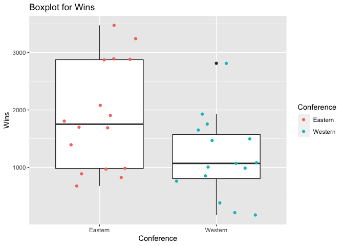

Project 1
================
Zichang Xiang
6/16/2021

-   [Reading and summarizing data from NHL
    API](#reading-and-summarizing-data-from-nhl-api)
-   [functions to contact the NHL records
    API](#functions-to-contact-the-nhl-records-api)
-   [function to contact the NHL stats
    API](#function-to-contact-the-nhl-stats-api)
-   [Wrapper function to call other
    function](#wrapper-function-to-call-other-function)
-   [Basic exploratory data analysis](#basic-exploratory-data-analysis)

### Reading and summarizing data from NHL API

#### Required Packages

jsonlite, RCurl, rmarkdown, httr, and ggplot2

``` r
#load the required packages
library(rmarkdown)
library(dplyr)
library(jsonlite)
library(RCurl)
library(httr)
library(ggplot2)
```

### functions to contact the NHL records API

#### function to return franchise

``` r
#retrieve the info and convert to a list
get_franchise <- GET("https://records.nhl.com/site/api/franchise")
franchise_cont <- content(get_franchise, "text", encoding = "UTF-8")
franchise_json<- fromJSON(franchise_cont, flatten = TRUE)
franchise_list <-as_tibble(franchise_json$data)
#create function
franchise <- function(name) {
  if (is.null(name)){
    return(franchise_list)
  }else if (is.character(name)){
  return(franchise_list %>% filter(fullName == name | teamAbbrev == name | teamCommonName == name |teamPlaceName ==    name) %>% collect())
  }else
  return(franchise_list %>% filter(mostRecentTeamId == name) %>% collect())
}
franchise(NULL)
```

    ## # A tibble: 39 x 8
    ##       id firstSeasonId fullName      lastSeasonId mostRecentTeamId teamAbbrev teamCommonName
    ##    <int>         <int> <chr>                <int>            <int> <chr>      <chr>         
    ##  1     1      19171918 Montréal Can…           NA                8 MTL        Canadiens     
    ##  2     2      19171918 Montreal Wan…     19171918               41 MWN        Wanderers     
    ##  3     3      19171918 St. Louis Ea…     19341935               45 SLE        Eagles        
    ##  4     4      19191920 Hamilton Tig…     19241925               37 HAM        Tigers        
    ##  5     5      19171918 Toronto Mapl…           NA               10 TOR        Maple Leafs   
    ##  6     6      19241925 Boston Bruins           NA                6 BOS        Bruins        
    ##  7     7      19241925 Montreal Mar…     19371938               43 MMR        Maroons       
    ##  8     8      19251926 Brooklyn Ame…     19411942               51 BRK        Americans     
    ##  9     9      19251926 Philadelphia…     19301931               39 QUA        Quakers       
    ## 10    10      19261927 New York Ran…           NA                3 NYR        Rangers       
    ## # … with 29 more rows, and 1 more variable: teamPlaceName <chr>

#### function to return total stats for every franchise

``` r
#retrieve info and convert to a list
get_total <- GET("https://records.nhl.com/site/api/franchise-team-totals")
total_cont <- content(get_total, "text", encoding = "UTF-8")
total_json<- fromJSON(total_cont, flatten = TRUE)
total_list <-as_tibble(total_json$data)
#create function team_totals
team_totals <- function(name) {
  if (is.null(name)){
    return(total_list)
  }else if (is.character(name)){
  return(total_list %>% filter(teamName == name | triCode == name) )
  }else
  return(total_list %>% filter(franchiseId == name) )
}

team_totals("MTL")
```

    ## # A tibble: 2 x 30
    ##      id activeFranchise firstSeasonId franchiseId gameTypeId gamesPlayed goalsAgainst
    ##   <int>           <int>         <int>       <int>      <int>       <int>        <int>
    ## 1    15               1      19171918           1          3         773         1959
    ## 2    16               1      19171918           1          2        6787        18260
    ## # … with 23 more variables: goalsFor <int>, homeLosses <int>, homeOvertimeLosses <int>,
    ## #   homeTies <int>, homeWins <int>, lastSeasonId <int>, losses <int>, overtimeLosses <int>,
    ## #   penaltyMinutes <int>, pointPctg <dbl>, points <int>, roadLosses <int>,
    ## #   roadOvertimeLosses <int>, roadTies <int>, roadWins <int>, shootoutLosses <int>,
    ## #   shootoutWins <int>, shutouts <int>, teamId <int>, teamName <chr>, ties <int>,
    ## #   triCode <chr>, wins <int>

``` r
team_totals(NULL)
```

    ## # A tibble: 105 x 30
    ##       id activeFranchise firstSeasonId franchiseId gameTypeId gamesPlayed goalsAgainst
    ##    <int>           <int>         <int>       <int>      <int>       <int>        <int>
    ##  1     1               1      19821983          23          2        2993         8902
    ##  2     2               1      19821983          23          3         257          634
    ##  3     3               1      19721973          22          2        3788        11907
    ##  4     4               1      19721973          22          3         309          897
    ##  5     5               1      19261927          10          2        6560        20020
    ##  6     6               1      19261927          10          3         518         1447
    ##  7     7               1      19671968          16          3         449         1332
    ##  8     8               1      19671968          16          2        4171        12255
    ##  9     9               1      19671968          17          2        4171        14049
    ## 10    10               1      19671968          17          3         391         1131
    ## # … with 95 more rows, and 23 more variables: goalsFor <int>, homeLosses <int>,
    ## #   homeOvertimeLosses <int>, homeTies <int>, homeWins <int>, lastSeasonId <int>,
    ## #   losses <int>, overtimeLosses <int>, penaltyMinutes <int>, pointPctg <dbl>,
    ## #   points <int>, roadLosses <int>, roadOvertimeLosses <int>, roadTies <int>,
    ## #   roadWins <int>, shootoutLosses <int>, shootoutWins <int>, shutouts <int>, teamId <int>,
    ## #   teamName <chr>, ties <int>, triCode <chr>, wins <int>

#### function to return season records

``` r
#create function season
season <- function(name) {
  if (is.null(name)){
  base_url <- paste0("https://records.nhl.com/site/api/franchise-season-records")
  get_season <- GET(base_url)
  season_cont <- content(get_season, "text", encoding = "UTF-8")
  season_json <- fromJSON(season_cont, flatten = TRUE)
  season_list <- as_tibble(season_json$data)
  return(season_list)
  }else if (is.numeric(name)){
   base_url <- paste0("https://records.nhl.com/site/api/franchise-season-records?cayenneExp=franchiseId=", name)
   get_season <- GET(base_url)
   season_cont <- content(get_season, "text", encoding = "UTF-8")
   season_json <- fromJSON(season_cont, flatten = TRUE)
   season_list <- as_tibble(season_json$data)
  return(season_list)}else{
  get_season <- GET("https://records.nhl.com/site/api/franchise-season-records")
  season_cont <- content(get_season, "text", encoding = "UTF-8")
  season_json <- fromJSON(season_cont, flatten = TRUE)
  season_list <- as_tibble(season_json$data)
  return(season_list %>% filter(franchiseName == name))
}}
season("Montréal Canadiens")
```

    ## # A tibble: 1 x 57
    ##      id fewestGoals fewestGoalsAgainst fewestGoalsAgainstSea… fewestGoalsSeaso… fewestLosses
    ##   <int>       <int>              <int> <chr>                  <chr>                    <int>
    ## 1     8         155                131 1955-56 (70)           1952-53 (70)                 8
    ## # … with 51 more variables: fewestLossesSeasons <chr>, fewestPoints <int>,
    ## #   fewestPointsSeasons <chr>, fewestTies <int>, fewestTiesSeasons <chr>, fewestWins <int>,
    ## #   fewestWinsSeasons <chr>, franchiseId <int>, franchiseName <chr>, homeLossStreak <int>,
    ## #   homeLossStreakDates <chr>, homePointStreak <int>, homePointStreakDates <chr>,
    ## #   homeWinStreak <int>, homeWinStreakDates <chr>, homeWinlessStreak <int>,
    ## #   homeWinlessStreakDates <chr>, lossStreak <int>, lossStreakDates <chr>,
    ## #   mostGameGoals <int>, mostGameGoalsDates <chr>, mostGoals <int>, mostGoalsAgainst <int>,
    ## #   mostGoalsAgainstSeasons <chr>, mostGoalsSeasons <chr>, mostLosses <int>,
    ## #   mostLossesSeasons <chr>, mostPenaltyMinutes <int>, mostPenaltyMinutesSeasons <chr>,
    ## #   mostPoints <int>, mostPointsSeasons <chr>, mostShutouts <int>,
    ## #   mostShutoutsSeasons <chr>, mostTies <int>, mostTiesSeasons <chr>, mostWins <int>,
    ## #   mostWinsSeasons <chr>, pointStreak <int>, pointStreakDates <chr>, roadLossStreak <int>,
    ## #   roadLossStreakDates <chr>, roadPointStreak <int>, roadPointStreakDates <chr>,
    ## #   roadWinStreak <int>, roadWinStreakDates <chr>, roadWinlessStreak <int>,
    ## #   roadWinlessStreakDates <chr>, winStreak <int>, winStreakDates <chr>,
    ## #   winlessStreak <int>, winlessStreakDates <chr>

``` r
season(NULL)
```

    ## # A tibble: 39 x 57
    ##       id fewestGoals fewestGoalsAgain… fewestGoalsAgainstS… fewestGoalsSeasons  fewestLosses
    ##    <int>       <int>             <int> <chr>                <chr>                      <int>
    ##  1     1         174               164 2003-04 (82)         2010-11 (82)                  19
    ##  2     2         170               190 1975-76 (80)         1972-73 (78)                  15
    ##  3     3         150               177 1970-71 (78)         1954-55 (70)                  17
    ##  4     4         173               164 1973-74 (78)         1967-68 (74)                  12
    ##  5     5         182               188 1997-98 (82)         1969-70 (76)                  21
    ##  6     6         147               172 1952-53 (70)         1955-56 (70)                  13
    ##  7     7         157               175 1998-99 (82)         2013-14 (82)                  16
    ##  8     8         155               131 1955-56 (70)         1952-53 (70)                   8
    ##  9     9         191               179 1998-99 (82)         1995-96 (82), 2019…           21
    ## 10    10         147               131 1953-54 (70)         1954-55 (70)                  16
    ## # … with 29 more rows, and 51 more variables: fewestLossesSeasons <chr>,
    ## #   fewestPoints <int>, fewestPointsSeasons <chr>, fewestTies <int>,
    ## #   fewestTiesSeasons <chr>, fewestWins <int>, fewestWinsSeasons <chr>, franchiseId <int>,
    ## #   franchiseName <chr>, homeLossStreak <int>, homeLossStreakDates <chr>,
    ## #   homePointStreak <int>, homePointStreakDates <chr>, homeWinStreak <int>,
    ## #   homeWinStreakDates <chr>, homeWinlessStreak <int>, homeWinlessStreakDates <chr>,
    ## #   lossStreak <int>, lossStreakDates <chr>, mostGameGoals <int>, mostGameGoalsDates <chr>,
    ## #   mostGoals <int>, mostGoalsAgainst <int>, mostGoalsAgainstSeasons <chr>,
    ## #   mostGoalsSeasons <chr>, mostLosses <int>, mostLossesSeasons <chr>,
    ## #   mostPenaltyMinutes <int>, mostPenaltyMinutesSeasons <chr>, mostPoints <int>,
    ## #   mostPointsSeasons <chr>, mostShutouts <int>, mostShutoutsSeasons <chr>, mostTies <int>,
    ## #   mostTiesSeasons <chr>, mostWins <int>, mostWinsSeasons <chr>, pointStreak <int>,
    ## #   pointStreakDates <chr>, roadLossStreak <int>, roadLossStreakDates <chr>,
    ## #   roadPointStreak <int>, roadPointStreakDates <chr>, roadWinStreak <int>,
    ## #   roadWinStreakDates <chr>, roadWinlessStreak <int>, roadWinlessStreakDates <chr>,
    ## #   winStreak <int>, winStreakDates <chr>, winlessStreak <int>, winlessStreakDates <chr>

#### function to return goalie records

``` r
#create function goalie
goalie <- function(name) {
  if (is.null(name)){
  base_url <- paste0("https://records.nhl.com/site/api/franchise-goalie-records")
  get_goalie <- GET(base_url)
  goalie_cont <- content(get_goalie, "text", encoding = "UTF-8")
  goalie_json <- fromJSON(goalie_cont, flatten = TRUE)
  goalie_list <- as_tibble(goalie_json$data)
  return(goalie_list)
  }else if (is.numeric(name)){
  base_url <- paste0("https://records.nhl.com/site/api/franchise-goalie-records?cayenneExp=franchiseId=", name)
  get_goalie <- GET(base_url)
  goalie_cont <- content(get_goalie, "text", encoding = "UTF-8")
  goalie_json <- fromJSON(goalie_cont, flatten = TRUE)
  goalie_list <- as_tibble(goalie_json$data)
  return(goalie_list %>% filter(franchiseId==name))}else{
  get_goalie <- GET("https://records.nhl.com/site/api/franchise-goalie-records")
  goalie_cont <- content(get_goalie, "text", encoding = "UTF-8")
  goalie_json <- fromJSON(goalie_cont, flatten = TRUE)
  goalie_list <- as_tibble(goalie_json$data)
  return(goalie_list %>% filter(franchiseName == name|lastName==name|firstName==name))
}}
goalie(1)
```

    ## # A tibble: 38 x 29
    ##       id activePlayer firstName franchiseId franchiseName    gameTypeId gamesPlayed lastName
    ##    <int> <lgl>        <chr>           <int> <chr>                 <int>       <int> <chr>   
    ##  1  1182 FALSE        Ken                 1 Montréal Canadi…          2         397 Dryden  
    ##  2   414 FALSE        Stephane            1 Montréal Canadi…          2           2 Fiset   
    ##  3   437 FALSE        Jeff                1 Montréal Canadi…          2         161 Hackett 
    ##  4   450 FALSE        Brian               1 Montréal Canadi…          2         141 Hayward 
    ##  5   457 FALSE        Denis               1 Montréal Canadi…          2          86 Herron  
    ##  6   469 FALSE        Pat                 1 Montréal Canadi…          2          40 Jablons…
    ##  7   511 FALSE        Roland              1 Montréal Canadi…          2           9 Melanson
    ##  8   527 FALSE        Andy                1 Montréal Canadi…          2          42 Moog    
    ##  9   549 FALSE        Lorne               1 Montréal Canadi…          2          47 Chabot  
    ## 10   559 FALSE        Abbie               1 Montréal Canadi…          2           1 Cox     
    ## # … with 28 more rows, and 21 more variables: losses <int>, mostGoalsAgainstDates <chr>,
    ## #   mostGoalsAgainstOneGame <int>, mostSavesDates <chr>, mostSavesOneGame <int>,
    ## #   mostShotsAgainstDates <chr>, mostShotsAgainstOneGame <int>,
    ## #   mostShutoutsOneSeason <int>, mostShutoutsSeasonIds <chr>, mostWinsOneSeason <int>,
    ## #   mostWinsSeasonIds <chr>, overtimeLosses <int>, playerId <int>, positionCode <chr>,
    ## #   rookieGamesPlayed <int>, rookieShutouts <int>, rookieWins <int>, seasons <int>,
    ## #   shutouts <int>, ties <int>, wins <int>

``` r
goalie(NULL)
```

    ## # A tibble: 1,078 x 29
    ##       id activePlayer firstName franchiseId franchiseName    gameTypeId gamesPlayed lastName
    ##    <int> <lgl>        <chr>           <int> <chr>                 <int>       <int> <chr>   
    ##  1   235 FALSE        Don                15 Dallas Stars              2         315 Beaupre 
    ##  2   236 FALSE        Bob                28 Arizona Coyotes           2         281 Essensa 
    ##  3   237 FALSE        Tony               11 Chicago Blackha…          2         873 Esposito
    ##  4   238 FALSE        Grant              25 Edmonton Oilers           2         423 Fuhr    
    ##  5   239 FALSE        Ron                16 Philadelphia Fl…          2         489 Hextall 
    ##  6   240 FALSE        Curtis             18 St. Louis Blues           2         280 Joseph  
    ##  7   241 FALSE        Olie               24 Washington Capi…          2         711 Kolzig  
    ##  8   242 FALSE        Mike               18 St. Louis Blues           2         347 Liut    
    ##  9   243 FALSE        Kirk               20 Vancouver Canuc…          2         516 McLean  
    ## 10   244 FALSE        Gilles             13 Cleveland Barons          2         250 Meloche 
    ## # … with 1,068 more rows, and 21 more variables: losses <int>, mostGoalsAgainstDates <chr>,
    ## #   mostGoalsAgainstOneGame <int>, mostSavesDates <chr>, mostSavesOneGame <int>,
    ## #   mostShotsAgainstDates <chr>, mostShotsAgainstOneGame <int>,
    ## #   mostShutoutsOneSeason <int>, mostShutoutsSeasonIds <chr>, mostWinsOneSeason <int>,
    ## #   mostWinsSeasonIds <chr>, overtimeLosses <int>, playerId <int>, positionCode <chr>,
    ## #   rookieGamesPlayed <int>, rookieShutouts <int>, rookieWins <int>, seasons <int>,
    ## #   shutouts <int>, ties <int>, wins <int>

#### function to return skater records

``` r
#create function skater
skater <- function(name) {
  if (is.null(name)){
  base_url <- paste0("https://records.nhl.com/site/api/franchise-skater-records")
  get_skater <- GET(base_url)
  skater_cont <- content(get_skater, "text", encoding = "UTF-8")
  skater_json <- fromJSON(skater_cont, flatten = TRUE)
  skater_list <- as_tibble(skater_json$data)
  return(skater_list)
  }else if (is.numeric(name)){
  base_url <- paste0("https://records.nhl.com/site/api/franchise-skater-records?cayenneExp=franchiseId=", name)
  get_skater <- GET(base_url)
  skater_cont <- content(get_skater, "text", encoding = "UTF-8")
  skater_json <- fromJSON(skater_cont, flatten = TRUE)
  skater_list <- as_tibble(skater_json$data)
  return(skater_list %>% filter(franchiseId==name))}else{
  get_skater<- GET("https://records.nhl.com/site/api/franchise-skater-records")
  skater_cont <- content(get_skater, "text", encoding = "UTF-8")
  skater_json <- fromJSON(skater_cont, flatten = TRUE)
  skater_list <- as_tibble(skater_json$data)
  return(skater_list %>% filter(franchiseName == name|lastName==name|firstName==name))
}}
skater(1)
```

    ## # A tibble: 800 x 31
    ##       id activePlayer assists firstName franchiseId franchiseName     gameTypeId gamesPlayed
    ##    <int> <lgl>          <int> <chr>           <int> <chr>                  <int>       <int>
    ##  1 17199 FALSE              0 Reg                 1 Montréal Canadie…          2           3
    ##  2 17223 FALSE              2 Art                 1 Montréal Canadie…          2          11
    ##  3 17272 FALSE              0 Dave                1 Montréal Canadie…          2           3
    ##  4 17351 FALSE              0 Ossie               1 Montréal Canadie…          2           2
    ##  5 17389 FALSE              0 Ron                 1 Montréal Canadie…          2           6
    ##  6 17440 FALSE              0 Jimmy               1 Montréal Canadie…          2           2
    ##  7 17484 FALSE              0 Max                 1 Montréal Canadie…          2           1
    ##  8 17508 FALSE              0 Bob                 1 Montréal Canadie…          2           2
    ##  9 17544 FALSE              0 Garry               1 Montréal Canadie…          2           1
    ## 10 17623 FALSE              0 Conrad              1 Montréal Canadie…          2           6
    ## # … with 790 more rows, and 23 more variables: goals <int>, lastName <chr>,
    ## #   mostAssistsGameDates <chr>, mostAssistsOneGame <int>, mostAssistsOneSeason <int>,
    ## #   mostAssistsSeasonIds <chr>, mostGoalsGameDates <chr>, mostGoalsOneGame <int>,
    ## #   mostGoalsOneSeason <int>, mostGoalsSeasonIds <chr>, mostPenaltyMinutesOneSeason <int>,
    ## #   mostPenaltyMinutesSeasonIds <chr>, mostPointsGameDates <chr>, mostPointsOneGame <int>,
    ## #   mostPointsOneSeason <int>, mostPointsSeasonIds <chr>, penaltyMinutes <int>,
    ## #   playerId <int>, points <int>, positionCode <chr>, rookieGamesPlayed <int>,
    ## #   rookiePoints <int>, seasons <int>

``` r
skater(NULL)
```

    ## # A tibble: 17,209 x 31
    ##       id activePlayer assists firstName franchiseId franchiseName     gameTypeId gamesPlayed
    ##    <int> <lgl>          <int> <chr>           <int> <chr>                  <int>       <int>
    ##  1 16888 FALSE            417 George              5 Toronto Maple Le…          2        1188
    ##  2 16889 FALSE              0 Billy               2 Montreal Wandere…          2           2
    ##  3 16890 FALSE            794 Johnny              6 Boston Bruins              2        1436
    ##  4 16891 FALSE            712 Jean                1 Montréal Canadie…          2        1125
    ##  5 16892 FALSE           1111 Ray                 6 Boston Bruins              2        1518
    ##  6 16893 FALSE             33 Harold              9 Philadelphia Qua…          2         216
    ##  7 16894 FALSE             13 Herb                9 Philadelphia Qua…          2         216
    ##  8 16895 FALSE            852 Bobby              16 Philadelphia Fly…          2        1144
    ##  9 16896 FALSE            142 Ken                23 New Jersey Devils          2        1283
    ## 10 16897 FALSE              0 Gerry               2 Montreal Wandere…          2           4
    ## # … with 17,199 more rows, and 23 more variables: goals <int>, lastName <chr>,
    ## #   mostAssistsGameDates <chr>, mostAssistsOneGame <int>, mostAssistsOneSeason <int>,
    ## #   mostAssistsSeasonIds <chr>, mostGoalsGameDates <chr>, mostGoalsOneGame <int>,
    ## #   mostGoalsOneSeason <int>, mostGoalsSeasonIds <chr>, mostPenaltyMinutesOneSeason <int>,
    ## #   mostPenaltyMinutesSeasonIds <chr>, mostPointsGameDates <chr>, mostPointsOneGame <int>,
    ## #   mostPointsOneSeason <int>, mostPointsSeasonIds <chr>, penaltyMinutes <int>,
    ## #   playerId <int>, points <int>, positionCode <chr>, rookieGamesPlayed <int>,
    ## #   rookiePoints <int>, seasons <int>

#### function to return detail records

``` r
#create function detail
detail <- function(name) {
  if (is.null(name)){
  base_url <- paste0("https://records.nhl.com/site/api/franchise-detail?")
  get_detail <- GET(base_url)
  detail_cont <- content(get_detail, "text", encoding = "UTF-8")
  detail_json <- fromJSON(detail_cont, flatten = TRUE)
  detail_list <- as_tibble(detail_json$data)
  return(detail_list)  
  }else if (is.numeric(name)){
  base_url <- paste0("https://records.nhl.com/site/api/franchise-detail?cayenneExp=mostRecentTeamId=", name)
  get_detail <- GET(base_url)
  detail_cont <- content(get_detail, "text", encoding = "UTF-8")
  detail_json <- fromJSON(detail_cont, flatten = TRUE)
  detail_list <- as_tibble(detail_json$data)
  return(detail_list %>% filter(mostRecentTeamId==name))}else{
  get_detail <- GET("https://records.nhl.com/site/api/franchise-detail")
  detail_cont <- content(get_detail, "text", encoding = "UTF-8")
  detail_json <- fromJSON(detail_cont, flatten = TRUE)
  detail_list <- as_tibble(detail_json$data)
  return(detail_list %>% filter(teamAbbrev == name|teamFullName==name))
}}
detail("Vancouver Canucks")
```

    ## # A tibble: 1 x 13
    ##      id active captainHistory     coachingHistory    dateAwarded directoryUrl  firstSeasonId
    ##   <int> <lgl>  <chr>              <chr>              <chr>       <chr>                 <int>
    ## 1    20 TRUE   "<ul class=\"stri… "<ul class=\"stri… 1970-05-22… https://www.…      19701971
    ## # … with 6 more variables: generalManagerHistory <chr>, heroImageUrl <chr>,
    ## #   mostRecentTeamId <int>, retiredNumbersSummary <chr>, teamAbbrev <chr>,
    ## #   teamFullName <chr>

``` r
detail(NULL)
```

    ## # A tibble: 39 x 13
    ##       id active captainHistory    coachingHistory    dateAwarded directoryUrl  firstSeasonId
    ##    <int> <lgl>  <chr>             <chr>              <chr>       <chr>                 <int>
    ##  1     1 TRUE   "<ul class=\"str… "<ul class=\"stri… 1917-11-26… https://www.…      19171918
    ##  2     2 FALSE   <NA>              <NA>              1917-11-26… <NA>               19171918
    ##  3     3 FALSE   <NA>              <NA>              1917-11-26… <NA>               19171918
    ##  4     4 FALSE   <NA>              <NA>              1917-11-26… <NA>               19191920
    ##  5     5 TRUE   "<ul class=\"str… "<ul class=\"stri… 1917-11-26… https://www.…      19171918
    ##  6     6 TRUE   "<ul class=\"str… "<ul class=\"stri… 1924-11-01… https://www.…      19241925
    ##  7     7 FALSE   <NA>              <NA>              1924-11-01… <NA>               19241925
    ##  8     8 FALSE   <NA>              <NA>              1925-09-22… <NA>               19251926
    ##  9     9 FALSE   <NA>              <NA>              1925-11-07… <NA>               19251926
    ## 10    10 TRUE   "<ul class=\"str… "<ul class=\"stri… 1926-05-15… https://www.…      19261927
    ## # … with 29 more rows, and 6 more variables: generalManagerHistory <chr>,
    ## #   heroImageUrl <chr>, mostRecentTeamId <int>, retiredNumbersSummary <chr>,
    ## #   teamAbbrev <chr>, teamFullName <chr>

### function to contact the NHL stats API

``` r
#create function stats
stats <- function(name) {
  if (is.null(name)){
    full_url <- paste0("https://statsapi.web.nhl.com/api/v1/teams","?expand=team.stats")
    }else{full_url <- paste0("https://statsapi.web.nhl.com/api/v1/teams/", name, "/?expand=team.stats")}
    get_stats <- GET(full_url)
    stats_cont <- content(get_stats, "text", encoding = "UTF-8")
    stats_json <- fromJSON(stats_cont, flatten = TRUE)
    stats_list <- as_tibble(stats_json$teams)
    return(stats_list)
}
stats(NULL)
```

    ## # A tibble: 32 x 28
    ##       id name   link  abbreviation teamName locationName firstYearOfPlay teamStats shortName
    ##    <int> <chr>  <chr> <chr>        <chr>    <chr>        <chr>           <list>    <chr>    
    ##  1     1 New J… /api… NJD          Devils   New Jersey   1982            <df [1 ×… New Jers…
    ##  2     2 New Y… /api… NYI          Islande… New York     1972            <df [1 ×… NY Islan…
    ##  3     3 New Y… /api… NYR          Rangers  New York     1926            <df [1 ×… NY Range…
    ##  4     4 Phila… /api… PHI          Flyers   Philadelphia 1967            <df [1 ×… Philadel…
    ##  5     5 Pitts… /api… PIT          Penguins Pittsburgh   1967            <df [1 ×… Pittsbur…
    ##  6     6 Bosto… /api… BOS          Bruins   Boston       1924            <df [1 ×… Boston   
    ##  7     7 Buffa… /api… BUF          Sabres   Buffalo      1970            <df [1 ×… Buffalo  
    ##  8     8 Montr… /api… MTL          Canadie… Montréal     1909            <df [1 ×… Montréal 
    ##  9     9 Ottaw… /api… OTT          Senators Ottawa       1990            <df [1 ×… Ottawa   
    ## 10    10 Toron… /api… TOR          Maple L… Toronto      1917            <df [1 ×… Toronto  
    ## # … with 22 more rows, and 19 more variables: officialSiteUrl <chr>, franchiseId <int>,
    ## #   active <lgl>, venue.name <chr>, venue.link <chr>, venue.city <chr>, venue.id <int>,
    ## #   venue.timeZone.id <chr>, venue.timeZone.offset <int>, venue.timeZone.tz <chr>,
    ## #   division.id <int>, division.name <chr>, division.link <chr>, conference.id <int>,
    ## #   conference.name <chr>, conference.link <chr>, franchise.franchiseId <int>,
    ## #   franchise.teamName <chr>, franchise.link <chr>

### Wrapper function to call other function

``` r
#create wrapper function to call other functions
wrapper <- function(fun, name){
  if (fun == "franchise"){
    return(franchise(name))
  }else if (fun == "team_totals"){
    return(team_totals(name))
  }else if (fun == "season"){
    return(season(name))
  }else if (fun == "goalie"){
    return(goalie(name))
  }else if (fun == "skater"){
    return(skater(name))
  }else if (fun == "detail"){
    return(detail(name))
  }else if (fun == "stats"){
    return(stats(name))
  }else{
    stop("Type the correct function!")
  }
  }
wrapper("stats", NULL)
```

    ## # A tibble: 32 x 28
    ##       id name   link  abbreviation teamName locationName firstYearOfPlay teamStats shortName
    ##    <int> <chr>  <chr> <chr>        <chr>    <chr>        <chr>           <list>    <chr>    
    ##  1     1 New J… /api… NJD          Devils   New Jersey   1982            <df [1 ×… New Jers…
    ##  2     2 New Y… /api… NYI          Islande… New York     1972            <df [1 ×… NY Islan…
    ##  3     3 New Y… /api… NYR          Rangers  New York     1926            <df [1 ×… NY Range…
    ##  4     4 Phila… /api… PHI          Flyers   Philadelphia 1967            <df [1 ×… Philadel…
    ##  5     5 Pitts… /api… PIT          Penguins Pittsburgh   1967            <df [1 ×… Pittsbur…
    ##  6     6 Bosto… /api… BOS          Bruins   Boston       1924            <df [1 ×… Boston   
    ##  7     7 Buffa… /api… BUF          Sabres   Buffalo      1970            <df [1 ×… Buffalo  
    ##  8     8 Montr… /api… MTL          Canadie… Montréal     1909            <df [1 ×… Montréal 
    ##  9     9 Ottaw… /api… OTT          Senators Ottawa       1990            <df [1 ×… Ottawa   
    ## 10    10 Toron… /api… TOR          Maple L… Toronto      1917            <df [1 ×… Toronto  
    ## # … with 22 more rows, and 19 more variables: officialSiteUrl <chr>, franchiseId <int>,
    ## #   active <lgl>, venue.name <chr>, venue.link <chr>, venue.city <chr>, venue.id <int>,
    ## #   venue.timeZone.id <chr>, venue.timeZone.offset <int>, venue.timeZone.tz <chr>,
    ## #   division.id <int>, division.name <chr>, division.link <chr>, conference.id <int>,
    ## #   conference.name <chr>, conference.link <chr>, franchise.franchiseId <int>,
    ## #   franchise.teamName <chr>, franchise.link <chr>

``` r
wrapper("franchise", NULL)
```

    ## # A tibble: 39 x 8
    ##       id firstSeasonId fullName      lastSeasonId mostRecentTeamId teamAbbrev teamCommonName
    ##    <int>         <int> <chr>                <int>            <int> <chr>      <chr>         
    ##  1     1      19171918 Montréal Can…           NA                8 MTL        Canadiens     
    ##  2     2      19171918 Montreal Wan…     19171918               41 MWN        Wanderers     
    ##  3     3      19171918 St. Louis Ea…     19341935               45 SLE        Eagles        
    ##  4     4      19191920 Hamilton Tig…     19241925               37 HAM        Tigers        
    ##  5     5      19171918 Toronto Mapl…           NA               10 TOR        Maple Leafs   
    ##  6     6      19241925 Boston Bruins           NA                6 BOS        Bruins        
    ##  7     7      19241925 Montreal Mar…     19371938               43 MMR        Maroons       
    ##  8     8      19251926 Brooklyn Ame…     19411942               51 BRK        Americans     
    ##  9     9      19251926 Philadelphia…     19301931               39 QUA        Quakers       
    ## 10    10      19261927 New York Ran…           NA                3 NYR        Rangers       
    ## # … with 29 more rows, and 1 more variable: teamPlaceName <chr>

### Basic exploratory data analysis

#### Combine data from two endpoints

``` r
#all goalies
goalie_all <- goalie(NULL)[,c(1:8)]
goalie_all <- goalie_all %>% mutate(Type = "goalie")
goalie_all
```

    ## # A tibble: 1,078 x 9
    ##       id activePlayer firstName franchiseId franchiseName    gameTypeId gamesPlayed lastName
    ##    <int> <lgl>        <chr>           <int> <chr>                 <int>       <int> <chr>   
    ##  1   235 FALSE        Don                15 Dallas Stars              2         315 Beaupre 
    ##  2   236 FALSE        Bob                28 Arizona Coyotes           2         281 Essensa 
    ##  3   237 FALSE        Tony               11 Chicago Blackha…          2         873 Esposito
    ##  4   238 FALSE        Grant              25 Edmonton Oilers           2         423 Fuhr    
    ##  5   239 FALSE        Ron                16 Philadelphia Fl…          2         489 Hextall 
    ##  6   240 FALSE        Curtis             18 St. Louis Blues           2         280 Joseph  
    ##  7   241 FALSE        Olie               24 Washington Capi…          2         711 Kolzig  
    ##  8   242 FALSE        Mike               18 St. Louis Blues           2         347 Liut    
    ##  9   243 FALSE        Kirk               20 Vancouver Canuc…          2         516 McLean  
    ## 10   244 FALSE        Gilles             13 Cleveland Barons          2         250 Meloche 
    ## # … with 1,068 more rows, and 1 more variable: Type <chr>

``` r
#all skaters
skater_all <-skater(NULL)[,c(1:2,4:8,10)]
skater_all <- skater_all %>% mutate(Type = "skater")
skater_all
```

    ## # A tibble: 17,209 x 9
    ##       id activePlayer firstName franchiseId franchiseName    gameTypeId gamesPlayed lastName
    ##    <int> <lgl>        <chr>           <int> <chr>                 <int>       <int> <chr>   
    ##  1 16888 FALSE        George              5 Toronto Maple L…          2        1188 Armstro…
    ##  2 16889 FALSE        Billy               2 Montreal Wander…          2           2 Bell    
    ##  3 16890 FALSE        Johnny              6 Boston Bruins             2        1436 Bucyk   
    ##  4 16891 FALSE        Jean                1 Montréal Canadi…          2        1125 Beliveau
    ##  5 16892 FALSE        Ray                 6 Boston Bruins             2        1518 Bourque 
    ##  6 16893 FALSE        Harold              9 Philadelphia Qu…          2         216 Darragh 
    ##  7 16894 FALSE        Herb                9 Philadelphia Qu…          2         216 Drury   
    ##  8 16895 FALSE        Bobby              16 Philadelphia Fl…          2        1144 Clarke  
    ##  9 16896 FALSE        Ken                23 New Jersey Devi…          2        1283 Daneyko 
    ## 10 16897 FALSE        Gerry               2 Montreal Wander…          2           4 Geran   
    ## # … with 17,199 more rows, and 1 more variable: Type <chr>

``` r
#all goalies and skaters 
goalie_skater_all <- rbind(goalie_all, skater_all)
goalie_skater_all <- goalie_skater_all[order(goalie_skater_all$id),]
goalie_skater_all
```

    ## # A tibble: 18,287 x 9
    ##       id activePlayer firstName franchiseId franchiseName    gameTypeId gamesPlayed lastName
    ##    <int> <lgl>        <chr>           <int> <chr>                 <int>       <int> <chr>   
    ##  1   235 FALSE        Don                15 Dallas Stars              2         315 Beaupre 
    ##  2   236 FALSE        Bob                28 Arizona Coyotes           2         281 Essensa 
    ##  3   237 FALSE        Tony               11 Chicago Blackha…          2         873 Esposito
    ##  4   238 FALSE        Grant              25 Edmonton Oilers           2         423 Fuhr    
    ##  5   239 FALSE        Ron                16 Philadelphia Fl…          2         489 Hextall 
    ##  6   240 FALSE        Curtis             18 St. Louis Blues           2         280 Joseph  
    ##  7   241 FALSE        Olie               24 Washington Capi…          2         711 Kolzig  
    ##  8   242 FALSE        Mike               18 St. Louis Blues           2         347 Liut    
    ##  9   243 FALSE        Kirk               20 Vancouver Canuc…          2         516 McLean  
    ## 10   244 FALSE        Gilles             13 Cleveland Barons          2         250 Meloche 
    ## # … with 18,277 more rows, and 1 more variable: Type <chr>

#### create at least two new variables

``` r
#all goalies
goalie_all <- goalie(NULL)[,c(1:9, 28:29)]
goalie_all
```

    ## # A tibble: 1,078 x 11
    ##       id activePlayer firstName franchiseId franchiseName    gameTypeId gamesPlayed lastName
    ##    <int> <lgl>        <chr>           <int> <chr>                 <int>       <int> <chr>   
    ##  1   235 FALSE        Don                15 Dallas Stars              2         315 Beaupre 
    ##  2   236 FALSE        Bob                28 Arizona Coyotes           2         281 Essensa 
    ##  3   237 FALSE        Tony               11 Chicago Blackha…          2         873 Esposito
    ##  4   238 FALSE        Grant              25 Edmonton Oilers           2         423 Fuhr    
    ##  5   239 FALSE        Ron                16 Philadelphia Fl…          2         489 Hextall 
    ##  6   240 FALSE        Curtis             18 St. Louis Blues           2         280 Joseph  
    ##  7   241 FALSE        Olie               24 Washington Capi…          2         711 Kolzig  
    ##  8   242 FALSE        Mike               18 St. Louis Blues           2         347 Liut    
    ##  9   243 FALSE        Kirk               20 Vancouver Canuc…          2         516 McLean  
    ## 10   244 FALSE        Gilles             13 Cleveland Barons          2         250 Meloche 
    ## # … with 1,068 more rows, and 3 more variables: losses <int>, ties <int>, wins <int>

``` r
#create three new variables
goalie_all <- goalie_all %>% mutate(loss_rate = goalie_all$losses/goalie_all$gamesPlayed, win_rate = goalie_all$wins/goalie_all$gamesPlayed, tie_rate =goalie_all$ties/goalie_all$gamesPlayed)
goalie_all
```

    ## # A tibble: 1,078 x 14
    ##       id activePlayer firstName franchiseId franchiseName    gameTypeId gamesPlayed lastName
    ##    <int> <lgl>        <chr>           <int> <chr>                 <int>       <int> <chr>   
    ##  1   235 FALSE        Don                15 Dallas Stars              2         315 Beaupre 
    ##  2   236 FALSE        Bob                28 Arizona Coyotes           2         281 Essensa 
    ##  3   237 FALSE        Tony               11 Chicago Blackha…          2         873 Esposito
    ##  4   238 FALSE        Grant              25 Edmonton Oilers           2         423 Fuhr    
    ##  5   239 FALSE        Ron                16 Philadelphia Fl…          2         489 Hextall 
    ##  6   240 FALSE        Curtis             18 St. Louis Blues           2         280 Joseph  
    ##  7   241 FALSE        Olie               24 Washington Capi…          2         711 Kolzig  
    ##  8   242 FALSE        Mike               18 St. Louis Blues           2         347 Liut    
    ##  9   243 FALSE        Kirk               20 Vancouver Canuc…          2         516 McLean  
    ## 10   244 FALSE        Gilles             13 Cleveland Barons          2         250 Meloche 
    ## # … with 1,068 more rows, and 6 more variables: losses <int>, ties <int>, wins <int>,
    ## #   loss_rate <dbl>, win_rate <dbl>, tie_rate <dbl>

#### create contingency tables

``` r
#table to summarize the relationship between player type and the number of active player
table(goalie_skater_all$Type, goalie_skater_all$activePlayer)
```

    ##         
    ##          FALSE  TRUE
    ##   goalie   929   149
    ##   skater 15242  1967

``` r
#table to summarize the relationship between divisions and timeZones
table(stats(NULL)$division.name, stats(NULL)$venue.timeZone.tz)
```

    ##                   
    ##                    CDT EDT MDT MST PDT
    ##   Discover Central   3   5   0   0   0
    ##   Honda West         2   0   1   1   4
    ##   MassMutual East    0   8   0   0   0
    ##   Scotia North       1   3   2   0   1

#### create numerical summaries

``` r
#quartiles and mean for wins in regular season
totals_regular <- team_totals(NULL) %>% filter(gameTypeId ==2) 
summary(totals_regular$wins)
```

    ##    Min. 1st Qu.  Median    Mean 3rd Qu.    Max. 
    ##       1     113     678     929    1497    3473

``` r
#quartiles and mean for games played
goalie_skater_all %>% group_by(Type) %>% summarize(min = min(gamesPlayed), avg = round(mean(gamesPlayed),0), med = median(gamesPlayed), max = max(gamesPlayed))
```

    ## # A tibble: 2 x 5
    ##   Type     min   avg   med   max
    ##   <chr>  <int> <dbl> <dbl> <int>
    ## 1 goalie     1    89    38  1259
    ## 2 skater     1   117    54  1687

#### creates plots

``` r
#create bar plot to compare number of players for each player type
g <- ggplot(goalie_skater_all, aes(x=Type))
g + geom_bar(aes(fill=as.factor(activePlayer)), position = "dodge")+ 
  ggtitle("Numer of Players for Each Player Type")+ 
  labs(x="Player Type")+
  scale_fill_discrete(name = "Active player")
```

<!-- -->

``` r
#create histogram
g <- ggplot(goalie_all, aes(x=wins, ..density..))
g + geom_histogram(bins  = 150)+
  labs(x="Wins", y="Density")+
  ggtitle("Histogram for Wins")+
  geom_density(col="red", lwd = 3, adjust =0.4)
```

<!-- -->

``` r
#create two new datasets
conference <- stats(NULL)[,c("id", "conference.name")]
totals <- team_totals(NULL) %>% filter(gameTypeId == 2, teamId %in% c(1:26,28:30,52:55)) %>% select(c(14, 26,27,30))
totals <- totals %>% rename(id = teamId)
conference <- conference %>% rename(Conference = conference.name)
conf_totals<- merge(totals,conference, by = "id")
#create boxplot for number of wins for each conference
g <- ggplot(conf_totals, aes(x = Conference, y = wins)) 
g + geom_boxplot() + 
  geom_jitter(aes(color = Conference)) + 
  ggtitle("Boxplot for Wins")+
  labs(x="Conference", y= "Wins")
```

<!-- -->

``` r
conf_totals
```

    ##    id losses              teamName wins Conference
    ## 1   1   1211     New Jersey Devils 1394    Eastern
    ## 2   2   1587    New York Islanders 1688    Eastern
    ## 3   3   2716      New York Rangers 2883    Eastern
    ## 4   4   1452   Philadelphia Flyers 2079    Eastern
    ## 5   5   1734   Pittsburgh Penguins 1903    Eastern
    ## 6   6   2403         Boston Bruins 3241    Eastern
    ## 7   7   1564        Buffalo Sabres 1805    Eastern
    ## 8   8   2302    Montréal Canadiens 3473    Eastern
    ## 9   9    940       Ottawa Senators  971    Eastern
    ## 10 10   2696   Toronto Maple Leafs 2873    Eastern
    ## 11 12    725   Carolina Hurricanes  827    Eastern
    ## 12 13    870      Florida Panthers  889    Eastern
    ## 13 14    947   Tampa Bay Lightning  985    Eastern
    ## 14 15   1467   Washington Capitals 1700    Eastern
    ## 15 16   2761    Chicago Blackhawks 2812    Western
    ## 16 17   2446     Detroit Red Wings 2891    Eastern
    ## 17 18    656   Nashville Predators  852    Western
    ## 18 19   1645       St. Louis Blues 1929    Western
    ## 19 20   1236        Calgary Flames 1497    Western
    ## 20 21    728    Colorado Avalanche 1007    Western
    ## 21 22   1337       Edmonton Oilers 1469    Western
    ## 22 23   1746     Vancouver Canucks 1649    Western
    ## 23 24    834         Anaheim Ducks  990    Western
    ## 24 25    738          Dallas Stars 1084    Western
    ## 25 26   1829     Los Angeles Kings 1754    Western
    ## 26 28    920       San Jose Sharks 1070    Western
    ## 27 29    698 Columbus Blue Jackets  678    Eastern
    ## 28 30    599        Minnesota Wild  759    Western
    ## 29 52    292         Winnipeg Jets  382    Western
    ## 30 53    262       Arizona Coyotes  214    Western
    ## 31 54     94  Vegas Golden Knights  173    Western

``` r
#create scatter plot
g <- ggplot(conf_totals, aes(x = wins, y = losses, group = Conference)) 
g+ geom_point(aes(color=Conference), position="jitter")+
   geom_smooth(aes(group=Conference),method=lm, formula= y~x, col="green")+
   ggtitle("Wins vs Losses")
```

<!-- -->
